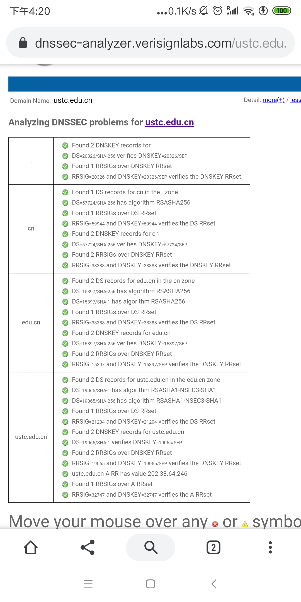

## [原创] ustc.edu.cn 域增加DNSSEC功能过程

本文原创：**中国科学技术大学 张焕杰**

修改时间：2019.09.13

清华大学段海新老师在2011年就写过有关DNSSEC的技术文章[DNSSEC 原理、配置与布署简介](https://blog.csdn.net/syh_486_007/article/details/50990973)，详细介绍了DNSSEC。本文记录 ustc.edu.cn 域增加DNSSEC功能的过程。

## ustc.edu.cn 域名情况

ustc.edu.cn 分了5个view，每个view有一个zone文件，因此有5个zone文件。为了使用bind 9.9以后支持的自动在线签名功能，bind 软件升级为9.14，使用chroot模式运行。

bind 大部分文件存放在 /var/named/chroot/var/named 目录，zone文件存放在 /var/named/chroot/var/named/zones 目录。

## 步骤一：生成ZSK和KSK密钥

```
cd /var/named/chroot/var/named
dnssec-keygen -r /dev/urandom -3 ustc.edu.cn
dnssec-keygen -f ksk -r /dev/urandom -3 ustc.edu.cn
```

生成了4个文件：
```
Kustc.edu.cn.+007+32747.key
Kustc.edu.cn.+007+32747.private
Kustc.edu.cn.+007+19065.key
Kustc.edu.cn.+007+19065.private
```

## 步骤二：在zone文件中增加key文件

在zone文件最后面增加：
```
$INCLUDE Kustc.edu.cn.+007+19065.key
$INCLUDE Kustc.edu.cn.+007+32747.key
```

## 步骤三：修改bind配置

如原来配置为
``` 
zone "ustc.edu.cn" in{ type master; file "zones/ustc.edu.cn.cernet";};
``` 
修改为
``` 
zone "ustc.edu.cn" in {
	type master;
	key-directory "/var/named";
	file "zones/ustc.edu.cn.cernet";
	auto-dnssec maintain;
	inline-signing yes;
};
```
同时，确保options中有启用dnssec功能的配置
```
	dnssec-enable yes;
```

## 步骤四：重启bind，生效配置

```
service named restart
```

重启后，访问`https://dnssec-analyzer.verisignlabs.com/ustc.edu.cn`能看到有DNSSEC相关记录，但有个警告是还没有DS记录。

注意：使用在线签名的时候，需要注意以下问题：

1. /var/named (注意chroot的位置) 目录对named可写

2. /var/named/zones 目录对named可写，并且不能有前缀相同，多了 .signed 后缀的文件，因为bind运行时要写这样的文件。

3. 如果有多个view，zone文件不能有名字相同的，原因是bind运行时签名写 .signed 文件时后面的view因为文件存在，会错误。解决办法是使用软链接不同的文件名，或者其中一个为master，其余为slave。
``` 

4. 自动在线签名会修改SOA中的序列号，不同服务器的序列号可能不一致，不会影响运行。


## 步骤五：上级服务器增加DS记录

执行以下命令获取DS记录
```
# dig @127.0.0.1 ustc.edu.cn dnskey | dnssec-dsfromkey  -f - ustc.edu.cn

ustc.edu.cn. IN DS 19065 7 1 4EBE527CCF84FC2DD62ACFCD464BE008E0FEAF68
ustc.edu.cn. IN DS 19065 7 2 EBD1C6420F893D8FF9950ADBF896075D0590064394196341285667098EBD74F1
```

将这些内容发给edu.cn服务器管理员，添加后，访问`https://dnssec-analyzer.verisignlabs.com/ustc.edu.cn`能看到DNSSEC工作正常。



## 参考资料

In-line Signing With NSEC3 in BIND 9.9+ -- A Walk-through [https://kb.isc.org/docs/aa-00711](https://kb.isc.org/docs/aa-00711)


## CentOS 6升级bind记录

```
yum install -y openssl-dev libcap-devel
wget https://downloads.isc.org/isc/bind9/9.14.6/bind-9.14.6.tar.gz
tar zxvf bind-9.14.6.tar.gz 
cd bind-9.14.6

./configure                     \
  --prefix=/usr --exec-prefix=/usr --bindir=/usr/bin                  \
  --sbindir=/usr/sbin --sysconfdir=/etc --localstatedir=/var          \
  --datadir=/usr/share --includedir=/usr/include --libdir=/usr/lib64  \
  --libexecdir=/usr/libexec --sharedstatedir=/var/lib                 \
  --mandir=/usr/share/man --infodir=/usr/share/info --with-libtool    \
  --with-pic --disable-static --disable-isc-spnego --enable-querytrace \
  --enable-fixed-rrset --enable-rpz-nsip --enable-rpz-nsdname         \
  --with-dlopen=yes --with-dlz-filesystem=yes --without-python
make
make install
```

升级后执行service named configtest出现错误

```entropy.c:26: fatal error: RAND_bytes(): error:24064064:lib(36):func(100):reason(100)
/etc/init.d/named: line 285:  1652 Aborted  /usr/sbin/named-checkconf $ckcf_options ${named_conf}
```
原因是/var/named/chroot/dev/下缺少文件 random urandom，执行
```
cd /dev
tar cvf - *rand* | ( cd /var/named/chroot/dev; tar xvf -)
```
并修改 /var/named/chroot/var/named 的owner为named.named后正常


***
欢迎 [加入我们整理资料](https://github.com/bg6cq/ITTS)
