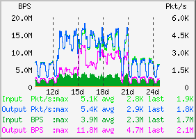

## [原创] DNS服务器的iptables规则

本文原创：**中国科学技术大学 张焕杰**

修改时间：2018.03.19

自己建立的DNS服务器，很容易出现如下的无效流量：

* 部分IP发来大量的查询，浪费服务器资源
* 非授权IP发来的查询，服务器会返回 非授权拒绝 应答包，浪费服务器对外带宽
* 部分攻击者伪造源地址发送 ANY 查询来进行反射式攻击，浪费服务器带宽

为解决以上攻击，我校对内提供DNS服务的iptables规则和简单说明如下，供参考。



上图是我校 [202.38.64.56](http://202.38.64.56) DNS 服务器在增加iptables前后的流量图，
可以看到增加iptables规则后流量下降了很多。


```
#!/bin/sh

iptables -F

iptables -N dnsin
iptables -N dnsout

#对收到的包，记录最近10秒钟的IP, 限制每个IP每秒钟20个查询
iptables -A dnsin -j ACCEPT -m hashlimit --hashlimit-name dns --hashlimit 20/sec --hashlimit-burst 10 \
	--hashlimit-mode srcip --hashlimit-htable-expire 10000
iptables -A dnsin -j DROP

#对非授权拒绝查询应答包限速每秒10个
iptables -A dnsout -j ACCEPT -m limit --limit 10/sec
iptables -A dnsout -j DROP

iptables -I INPUT -j dnsin -p udp --dport 53

#对非授权拒绝查询的应答包限速
iptables -A OUTPUT -j dnsout -m u32 -p udp --sport 53 --u32 "28&0xFFFF=0x8105"

#禁止大包应答
iptables -A OUTPUT -j DROP -p udp --sport 53 -m length --length 1300:

```

***
欢迎 [加入我们整理资料](https://github.com/bg6cq/ITTS)
