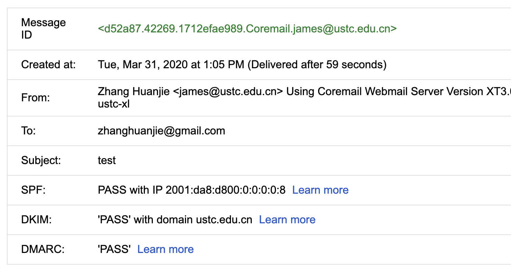

# 启用SPF、DKIM、DMARC提高邮件系统安全性

本文原创：**中国科学技术大学 张焕杰**

修改时间：2020.03.31

电子邮件服务器之间使用SMTP协议传输邮件。SMTP协议设计时，并未考虑服务器间的身份验证，这样就带来伪造地址发送邮件的隐患。

为了解决伪造邮件的问题，后来又增加了SPF、DKIM和DMARC技术。

邮件服务器，都应该进行SPF、DKIM和DMARC相关设置，以提高安全性。

下面以 ustc.edu.cn 域为例简单介绍三种技术的设置内容。

### 一、SPF(Sender Policy Framework)

SPF的原理非常简单：使用DNS服务器对外发布自己域的邮件发送IP地址信息。

如 ustc.edu.cn 域设置了如下TXT记录:

```
$ dig ustc.edu.cn txt

;; QUESTION SECTION:
;ustc.edu.cn.			IN	TXT

;; ANSWER SECTION:
ustc.edu.cn.		3600	IN	TXT	"v=spf1 ip4:202.38.64.8 ip4:202.38.64.16 ip4:202.38.64.46 ip4:202.141.160.8 ip4:222.195.68.193 ip4:202.141.161.73 ip4:195.128.10.69 ip6:2001:da8:d800::8 ip6:2001:da8:d800::46 -all"
```
上述TXT记录，对外公布了若干合法的发邮件IPv4/IPv6地址。最后的 -all 含义是不在列表内的IP，对外发送@ustc.edu.cn 邮件，都应该被认为是伪造的并丢弃。

SPF的启用非常容易，仅仅在自己的DNS域名服务器上添加TXT记录即可，发送方的邮件服务器不需要做修改。

邮件服务器也推荐启用SPF功能，可以避免收到伪造地址的邮件。

如果您设置了SPF，可以使用 [https://mxtoolbox.com/spf.aspx ](https://mxtoolbox.com/spf.aspx) 进行测试。


### 二、DKIM(DomainKeys Identified Mail)

DKIM相比SPF更进一步：使用DNS服务器对外发布邮件服务器的公钥；邮件服务器在发出邮件时，使用对应的私钥对邮件部分信息进行签名。

邮件发送方服务器会对邮件头的From/To/Subject/Date/Message-ID等字段内容进行签名，接收方的邮件服务器验证后，可以确保这些内容是真实可靠，未被修改的。

下面是一封邮件，通过了SPF、DKIM验证的结果：



启用DKIM分两步：

* 2.1 邮件服务器上生成私钥/公钥对，并启用DKIM签名功能

对于常用的Coremail邮件系统，请联系Coremail技术支持工程师操作，预计5分钟可以完成。

* 2.2 DNS服务器上添加TXT记录

如ustc.edu.cn 域，需要设置 dkim._domainkey.ustc.edu.cn TXT记录(其中dkim是selector，可以根据需要修改):

```
$ dig dkim._domainkey.ustc.edu.cn txt

;; QUESTION SECTION:
;dkim._domainkey.ustc.edu.cn.	IN	TXT

;; ANSWER SECTION:
dkim._domainkey.ustc.edu.cn. 3600 IN	TXT	"v=DKIM1; k=rsa; p=MIGfMA0GCSqGSIb3DQEBAQUAA4GNADCBiQKBgQDJvKz7FR0FC8iH15PgZIW720prG7yeJSc0ZVtrT1Q6pOazbMevkNTIYap+VQfh0qqrkDq0WXiJJ6IwURaPFluYs5Gxcj84RAX9s2qBhzlGA6HdvRGH8PwnFW4wacM6c8v62aWP/NfslJg+LZkRpLJG7e52Fv6RFKhkoNpQYyGfmQIDAQAB"
```

如果DNS上设置了DKIM记录，可以使用 [https://mxtoolbox.com/dkim.aspx ](https://mxtoolbox.com/dkim.aspx) 进行测试。

### 三、DMARC(Domain-based Message Authentication, Reporting & Conformance)

如果收发服务器双方都实现了上述的SPF、DKIM技术，邮件伪造的问题已经解决。

DMARC是锦上添花的功能，通过DNS发布信息，当邮件接收方收到伪造的邮件时，可以给被伪造的域名管理员发送反馈。

如ustc.edu.cn 域，需要设置 _dmarc.ustc.edu.cn TXT记录:
```
$ dig _dmarc.ustc.edu.cn txt

;; QUESTION SECTION:
;_dmarc.ustc.edu.cn.		IN	TXT

;; ANSWER SECTION:
_dmarc.ustc.edu.cn.	3600	IN	TXT	"v=DMARC1; p=quarantine; rua=mailto:postmaster@ustc.edu.cn"
```
其含义是接收方如果收到未通过SPF、DKIM验证的邮件，应该隔离(一般是投递到垃圾文件夹)，并将相关信息发给 postmaster@ustc.edu.cn

邮件系统管理员从收到的邮件中，可以了解潜在的SPF、DKIM配置错误信息。

如果DNS上设置了DMARC记录，可以使用 [https://mxtoolbox.com/DMARC.aspx ](https://mxtoolbox.com/DMARC.aspx) 进行测试。

### 附录： lists.ustc.edu.cn 启用SPF、DKIM、DMARC 的过程

lists.ustc.edu.cn 是 sympa mail lists服务器，IP地址是 202.38.95.62/2001:da8:d800:95::62，使用的邮件软件是postfix。

0. 准备

DNS中设置如下的DNS PTR记录：

```
$ORIGIN 95.38.202.in-addr.arpa.
62.95.38.202.in-addr.arpa.	IN	PTR	lists.ustc.edu.cn.

$ORIGIN 0.0.8.d.8.a.d.0.1.0.0.2.ip6.arpa
62.0.0.0.0.0.0.0.0.0.0.0.0.0.0.0.5.9.0.0 IN PTR lists.ustc.edu.cn.
```

1. SPF设置

DNS中增加如下记录：
```
lists          IN      A       202.38.95.62
               IN      TXT     "v=spf1 ip4:202.38.95.62 ~all"
               IN      AAAA    2001:da8:d800:95::62
               IN      TXT     "v=spf1 a -all"
```

2. DKIM设置

设置好epel库，安装opendkim：
```
yum install opendkim
```

生成DKIM key (使用的selector 名称为default)
```
# 请替换下面的域名
export domain=lists.ustc.edu.cn

mkdir /etc/opendkim/keys/$domain

cd /etc/opendkim/keys/$domain

opendkim-genkey -d $domain -s default

chown -R opendkim:opendkim /etc/opendkim/keys/$domain

echo "default._domainkey.$domain $domain:default:/etc/opendkim/keys/$domain/default.private" >> /etc/opendkim/KeyTable

echo "*@$domain default._domainkey.$domain" >> /etc/opendkim/SigningTable
```
生成之后打开/etc/opendkim/keys/lists.ustc.edu.cn/default.txt，里面就是DKIM key，需要添加到DNS，主机记录为default._domainkey.lists.ustc.edu.cn，记录值为括号里面的（去掉引号）。
```
default._domainkey.lists        IN      TXT     "v=DKIM1; k=rsa; p=MIGfMA0GCSqGSIb3DQEBAQUAA4GNADCBiQKBgQDZyUmKw+U9kG520nVyoe9aFUIq8wQ+Izvdb7qyFS+DKGElpWmDAIrxjfHWNfWVSadHzqZv6pyoasL1ZVrgkq59fQyOpRbvdQzXm3hbrQFZvyQLvBkqnV7XelHyxWNTKS4MQcP9IaeClwMIHJ8Q5xTH6PJF18o55Q9OH8n1vq53oQIDAQAB"
```

修改openDKIM设置
```
vi /etc/opendkim.conf

1. 将Mode 改为 Mode sv
2. 将Domain 改为 Domain lists.ustc.edu.cn
3. 将所有变量前面的#去掉，但是KeyFile、Statistics加上#
4. 再把SigningTable /etc/opendkim/SigningTable改成SigningTable refile:/etc/opendkim/SigningTable
```

启动openDKIM
```
chkconfig opendkim on
service opendkim start
```

设置Postfix
```
vi /etc/postfix/main.cf

加上下面幾行
# opendkim setup
smtpd_milters = inet:127.0.0.1:8891
non_smtpd_milters = inet:127.0.0.1:8891
milter_default_action = accept
```
重启服务

```
service opendkim restart
service postfix restart
chkconfig opendkim on
```
PS: 第一次启动如果出现 Generating default DKIM keys: hostname: Unknown host 可以在 /etc/hosts 上面加上域名，例如：

```
127.0.0.1 lists.ustc.edu.cn localhost localhost.localdomain localhost4 localhost4.localdomain4
```

3. sympa 设置

sympa 与DKIM设置有关的很多，我们采用最简单的方式。

默认的sympa发出的邮件，From地址是用户的，这样就相当于伪造地址发送。
因此在 /etc/sympa.conf 增加以下配置，将From地址重写为
`From:  “User Name”  (userEmail@address.com) <listName@lists.illinois.edu>`

```
dmarc_protection_mode all
dmarc_protection_phrase name_and_email
```

4. DMARC设置

DNS中增加如下记录：
```
_dmarc.lists.ustc.edu.cn.	3600	IN	TXT	"v=DMARC1; p=quarantine; rua=mailto:postmaster@ustc.edu.cn"
```

***
欢迎 [加入我们整理资料](https://github.com/bg6cq/ITTS)
