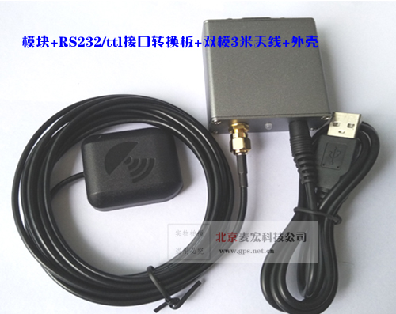
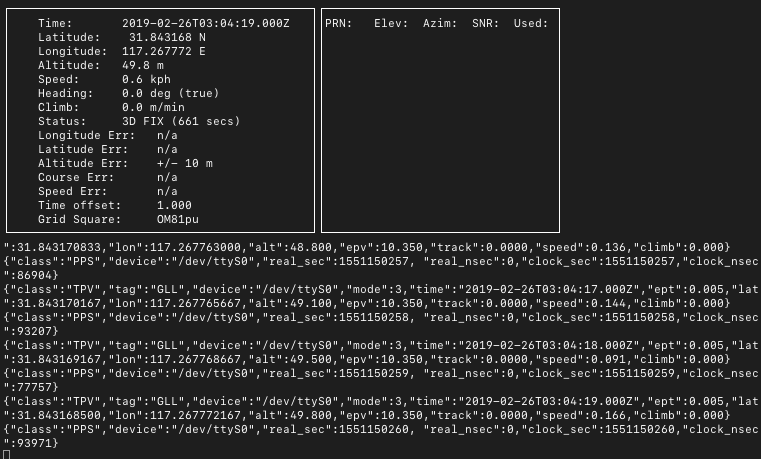
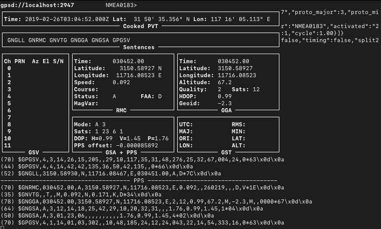

## [原创] 用GPS模块建立高精度ntp服务器

本文原创：**中国科学技术大学 张焕杰**

修改时间：2019.02.26

# 零、高精度时间的定义

简单的说，衡量时间主要有2个参数，分别是offset和jitter。offset可以理解为与标准时间的偏差，jitter可以理解为时间均匀度。

比如一个石英钟，每天对比与CCTV新闻联播时间一致，可以认为jitter为0，但offset并不一定为0，因为电视信号传播需要时间。

理想的ntp服务器，offset和jitter都为0。

对于现实的计算机，我们希望：

* 时间单向增加，也就是不会发生往回调表的情况。
* 时间均匀增加，也就是不会忽快忽慢，即上面描述的jitter尽量接近0。
* 与标准时间偏差尽量少，即上面描述的offset尽量接近0。

使用GPS模块授时的ntp服务器，据称offset可以到10µs(即0.01ms，大约相当于光或电波传播3km的时间)左右，jitter与服务器晶振和环境温度有关，一般可以到10µs以下(即0.01ms)。

# 一、GPS授时简单原理

GPS卫星有精密时钟源，GPS模块依靠接收到信号时间差来计算位置，同时可以通过以下两种方式对外输出时间信息：

一是通过串口输出NMEA语句，如下的北斗格式（GPS格式，前面是$GPRMC）输出：

```
$GNRMC,015022.00,A,3150.59184,N,11716.04078,E,0.242,,260219,,,D,V*12
```

其中的015022是时间01:50:22（UTC时间，对应的北京时间是09:50:22），260219是2019年2月26日。

这种输出，由于串口工作在9600BPS速率，误差比较大。

二是通过引脚 1PPS，信号的上升沿表示每秒钟的开始。1PPS信号的精度比较高，在10-30ns。

结合以上两种方式，可以从GPS模块得到高精度的时钟信号。

# 二、GPS模块/接收器的选择

如果是连接PC机使用，建议选择RS232信号电平的模块，如果连接树莓派机器使用，可以使用TTL信号电平的模块。

绝大部分GPS模块，引出了电源、地、RX、TX四根线，而并未将1PPS信号引出。用作ntp时，购买时让商家断开RX信号，引出1PPS信号。

我从taobao 深圳北天通讯 购买的 GPS/北斗双模BS-70DU接收器，其中USB口用来给模块供电，RS232口用来通信。

特别注意：购买时与店主沟通，让店主断开RX信号，将1PPS信号连接到DB9的1口，即DCD信号。

模块外形如下：


后来，我又从taobao 北京GPS北斗专业店 购买了 M8N 双频10HZ输出 RS232接口 USB供电MH16-N1 北斗GPS，购买时与店主沟通，要求 

1PPS信号接rs 232的1脚（dcd）。

模块外形如下：




# 三、服务器的安装

本来计划使用atom处理的小盒子做ntp服务器，测试时发现无法成功，可能与atom处理的CPU自动降频有关。后来找了一台比较老的服务器，顺利完成。

## 3.1 安装OS和软件

使用的是CentOS 7，安装系统后，运行以下命令安装需要的软件：

```
yum install -y epel-release
yum install -y ntp pps-tools gpsd gpsd-clients
```

## 3.2 gpsd设置

gpsd是用来读取GPS模块信息，并将信息放到一段共享内存，供ntpd之类的其他应用使用。

编辑 `/etc/sysconfig/gpsd`，修改为（GPS模块232口接在COM1，也就是ttysS0）
```
# Options for gpsd, including serial devices
OPTIONS="-n /dev/ttyS0"
# Set to 'true' to add USB devices automatically via udev
USBAUTO="true"
```
设置gpsd启动：
```
systemctl start gpsd
systemctl enable gpsd
```
这时执行`cgps`或`gpsmon`可以看到信息，分别如下图所示，其中有位置信息、PPS信息，说明GPS模块工作正常：





## 3.3 ntpd设置

CentOS 7默认的是chronyd，我还是使用相对熟悉的ntpd。

编辑文件`/etc/ntp.conf`,增加如下内容：
```
server 127.127.28.0 minpoll 4 maxpoll 4
fudge 127.127.28.0 refid GPS

server 127.127.28.1 minpoll 4 max poll 4 prefer
fudge 127.127.28.1 refid PPS
```
这里的127.127.28.0和127.127.28.1是虚拟设备，含义是获取gpsd放到共享内存中的信息来对时。


设置ntpd启动，并放开防火墙：
```
systemctl stop chronyd
systemctl disable chronyd
systemctl start ntpd
systemctl enable ntpd
firewall-cmd --add-service=ntp --permanent
firewall-cmd --reload
```
如果执行这些命令时，系统的时间大致正确，过10来分钟，执行`ntpstat`看到如下输出，说明工作正常：
```
synchronised to UHF radio at stratum 1 
   time correct to within 1 ms
   polling server every 64 s
```

执行命令`ntpq -p`可以看到ntpd的工作状态：
```
# ntpq -p
     remote           refid      st t when poll reach   delay   offset  jitter
==============================================================================
+static-5-103-13 .GPS.            1 u   43   64  377  425.213  -51.480   1.376
-biisoni.miuku.n 207.224.49.219   2 u   58   64  377  247.198  -16.032  11.992
x2001:1af8:4700: 130.133.1.10     2 u   43   64  377  318.917    5.976   1.928
+SHM(0)          .GPS.            0 l    9   16  377    0.000  -109.06   7.257
*SHM(1)          .PPS.            0 l    9   16  377    0.000    0.002   0.001
```
这里显示服务器时钟与 PPS 信号的offset是0.002ms（即2us），jitter是0.001ms(即1us)。

而GPS NMEA信号，因为RS232串口传输慢，要慢109.06ms（大约0.1s）。GNRMC消息大约70个字节长，每个字节前有开始bit，后有结束bit，
传输70字节的消息需要 70*(2+8)/9600=0.073 秒。

此时，从其他计算机执行`ntpdate ntp服务器IP地址`，可以完成对时操作。

使用ntpdate对时，可能会引起时钟往前跳变。因此，重要的服务器建议直接用ntp同步对时。

如果允许其他服务器想使用带有gps模块的ntp服务器进行同步，则需要在ntp.conf中增加(其中c.c.c.c是其他ntp服务器的IP地址)
```
restrict c.c.c.c nomodify notrap 
```

在其他服务器的 ntp.conf 中增加(其中s.s.s.s是其他带有GPS模块的ntp服务器IP地址)
```
server s.s.s.s minpoll 3 maxpoll 3 prefer
```
注意：有些版本的服务器minpoll和maxpoll最小允许为4，即16秒查询一次。ntpq -p 可以看到。如果设置为3或4，ntp对时后，offset可以到20us以下。

# 四、服务器运行状态监控

如果想监视ntp服务器的运行状况，可以参考 https://www.satsignal.eu/ntp/NTPandMRTG.html

下面是我参考网页的做法：
```
 yum install mrtg httpd
```

vi `/etc/mrtg/ntp.cfg`，输入以下内容：
```
HtmlDir: /var/www/mrtg
ImageDir: /var/www/mrtg
LogDir: /var/lib/mrtg

Target[ntp]: `perl /etc/mrtg/GetNTPoffset.pl 127.0.0.1`
MaxBytes[ntp]: 100000
Title[ntp]: NTP statistics - offset from UTC
Options[ntp]: integer, gauge, nopercent, growright
Colours[ntp]: BLUE#0033FF, RED#FF0000, BLUE#0033FF, RED#FF0000, 
YLegend[ntp]: offset +/- us
ShortLegend[ntp]: µs
LegendI[ntp]: offset µs (-):&nbsp;
LegendO[ntp]: offset µs (+):&nbsp;
Legend1[ntp]: Time offset in µs (-)
Legend2[ntp]: Time offset in µs (+)
PageTop[ntp]: <H1>NTP server</H1>
```

vi `/etc/mrtg/GetNTPoffset.pl`，输入以下内容:
```
# Expects node name as a parameter
# Returns 1st value for positive offsets, second value for negative
# Returns microseconds of offset
$ntp_str = `/usr/sbin/ntpq -c rv $ARGV[0]`;       # execute "ntpq -c rv <node>"
$val = (split(/\,/,$ntp_str))[20];      # get the offset string
$val =~ s/offset=//i;                   # remove the "offset="
$val = int (1000 * $val);               # convert to microseconds
$nval = $val;                           # prepare the negative value
if ($val < 0){
	$nval = -$nval;                         # make the value positive
	$val = 0;                               # ensure zero return for the positive
} else {
	$nval = 0;                              # ensure zero return for the negative
}
print "$nval\n";                        # return four numbers, incoming
print "$val\n";                         # outgoing
print "0\n";
print "$ARGV[0]\n";
```

执行`crontab -e`，增加一行
```
*/5 * * * *  env LANG=C /usr/bin/mrtg /etc/mrtg/ntp.conf
```

`vi /etc/httpd/conf.d/mrtg.conf`，放开访问权限。

执行以下命令，启动httpd：
```
systemctl start httpd
systemctl enable httpd
firewall-cmd --add-service=http --permanent
firewall-cmd --reload
```

然后访问 http://x.x.x.x/mrtg/ntp.html 就能看到 offset 的变化情况了。

参考资料：

* http://www.catb.org/gpsd/gpsd-time-service-howto.html
* https://www.satsignal.eu/ntp/Raspberry-Pi-NTP.html
* https://pthree.org/2013/11/05/real-life-ntp/

***
欢迎 [加入我们整理资料](https://github.com/bg6cq/ITTS)
