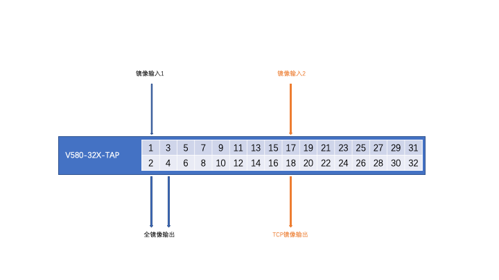

## [原创] 初试盛科TAP交换机

本文原创：**中国科学技术大学 张焕杰**

修改时间：2019.04.18

网络出口处需要各种流量镜像，而普通交换机提供的流量镜像功能往往不怎么好用。为此我校采购了上海交大姜开达老师推荐的盛科V580-32X-TAP交换机，专门用于出口流量的镜像分流使用。

http://www.centecnetworks.com/cn/SolutionList.asp?ID=95 有关于V580-TAP系列设备的介绍相关文档。

昨天TAP交换机到货后，进行了配置并上线，初步体验了TAP交换机的基本功能。

## 一、镜像需求

长期计划是将学校出口链路分光后引入TAP交换机，然后根据需要分流至不同的设备。因分光器还没有采购，目前的流量来自核心交换机镜像口。

我校核心交换机有2个镜像输出口，其中第1个接口的流量，需要发送给2台设备，做流量分析使用；第2个接口的TCP流量，需要发送给1台IXCache 缓存服务器的采集口，用来采集用户发出的URL请求。

在使用TAP交换机之前，这2个镜像输出口接至1台普通10G交换机，在10G交换机上设置2个镜像组，分别输出给3台设备。在使用普通10G交换机镜像时，有以下不便：

* 输入接口需要设置隔离，不然1个接口接收的数据包会从另1个输入接口发出
* 镜像组有数量限制，很快可能不够用
* 镜像不灵活，比如第2组输入，只能全镜像输出，无关的UDP流量也被输出了

## 二、TAP交换机使用

V580-32X-TAP交换机共有32个10G接口。连接方式如下图：



交换机上设置了2个tap组，第1个是简单的全镜像，第2个镜像时增加了flow规则，仅仅对tcp流量镜像，相关配置如下：
```
flow ixcache-tcp
 sequence-num 10 permit tcp src-ip any dst-ip any
 exit
!
tap-group alldump 1
 ingress eth-0-1
 egress eth-0-2
 egress eth-0-4
!
tap-group ixcache 2
 ingress eth-0-17 flow ixcache-tcp
 egress eth-0-18
```

下面是运行一段时间后，show interface看到的接口输出(仅保留统计信息)。

从这些统计可以看到，eth-0-1接口的输入，被全镜像到eth-0-2和eth-0-4接口；而eth-0-17接口的输入，TCP包被镜像到eth-0-18接口。

```
tap-switch# show interface eth-0-1
Interface eth-0-1
    5 minutes input rate 8189271675 bits/sec, 1137138 packets/sec

tap-switch# show interface eth-0-2
Interface eth-0-2
    5 minutes output rate 8186949127 bits/sec, 1136862 packets/sec

tap-switch# show interface eth-0-4
Interface eth-0-4
    5 minutes output rate 8191219149 bits/sec, 1137600 packets/sec

tap-switch# show interface eth-0-17
Interface eth-0-17
    5 minutes input rate 5598891465 bits/sec, 884350 packets/sec

tap-switch# show interface eth-0-18
Interface eth-0-18
    5 minutes output rate 2656587822 bits/sec, 493620 packets/sec
```

***
欢迎 [加入我们整理资料](https://github.com/bg6cq/ITTS)
