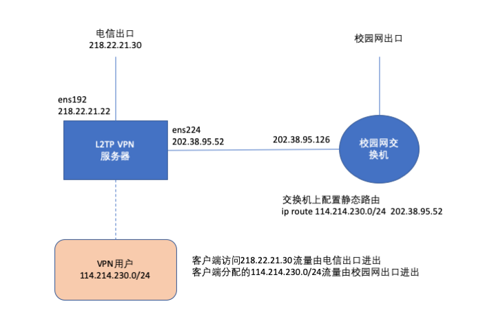

## [原创] L2TPVPN 服务器安装(Centos7)

本文原创：**中国科学技术大学 张焕杰**

修改时间：2020.02.03

学校的L2TPvpn服务器是CentOS 6，运行一段时间后，xl2tpd进程就会占用很多CPU，新用户无法连接。

今天重新安装了一台CentOS 7，下面是安装记录。

## 一、网络架构

L2TPVPN服务器有2个网卡，其中ens192设置电信IP地址用来接受客户端连接。

ens224设置校内IP地址连接校园网交换机用来转发客户端数据包。客户端数据包从ens224交给校园网交换机(依靠ip rule做策略路由)。校园网交换机上也增加对应的静态路由。
L2TPVPN用户分配校园网IP地址，L2TPVPN服务器上不做NAT。

用户验证使用radius服务器。

相关拓扑图如下：




## 二、服务器安装

服务器是虚拟机，2个网卡。

2.1 安装Centos 7

我用的是 CentOS Linux release 7.7.1908

2.2 更新、启用epel库、安装需要的软件、重启

```
yum install -y epel-release
yum update -y
yum install -y xl2tpd libreswan lsof radiusclient-ng radiusclient-ng-utils wget net-tools
reboot
```

## 三、服务器配置

3.1 查看主机是否支持pptp，返回结果为yes表示通过

```
modprobe ppp-compress-18 && echo yes
```

3.2 配置radius服务器

vi /etc/radiusclient-ng/servers

增加如下内容，第一个为raidus服务器地址，第二个为密钥
```
202.38.64.X  testtest
```

vi /etc/radiusclient-ng/radiusclient.conf

```
authserver 	202.38.64.X:1812
acctserver 	202.38.64.X:1813
```

增加MS-CHAP-V2属性：

vi /usr/share/radiusclient-ng/dictionary，增加一行
```
INCLUDE /usr/share/radiusclient-ng/dictionary.microsoft
```

vi /usr/share/radiusclient-ng/dictionary.microsoft，增加如下内容

```
#
#	Microsoft's VSA's, from RFC 2548
#
#	$Id: dictionary.microsoft,v 1.1 2004/11/14 07:26:26 paulus Exp $
#

VENDOR		Microsoft	311	Microsoft

ATTRIBUTE	MS-CHAP-Response	1	string	Microsoft
ATTRIBUTE	MS-CHAP-Error		2	string	Microsoft
ATTRIBUTE	MS-CHAP-CPW-1		3	string	Microsoft
ATTRIBUTE	MS-CHAP-CPW-2		4	string	Microsoft
ATTRIBUTE	MS-CHAP-LM-Enc-PW	5	string	Microsoft
ATTRIBUTE	MS-CHAP-NT-Enc-PW	6	string	Microsoft
ATTRIBUTE	MS-MPPE-Encryption-Policy 7	string	Microsoft
# This is referred to as both singular and plural in the RFC.
# Plural seems to make more sense.
ATTRIBUTE	MS-MPPE-Encryption-Type 8	string	Microsoft
ATTRIBUTE	MS-MPPE-Encryption-Types  8	string	Microsoft
ATTRIBUTE	MS-RAS-Vendor		9	integer	Microsoft
ATTRIBUTE	MS-CHAP-Domain		10	string	Microsoft
ATTRIBUTE	MS-CHAP-Challenge	11	string	Microsoft
ATTRIBUTE	MS-CHAP-MPPE-Keys	12	string	Microsoft
ATTRIBUTE	MS-BAP-Usage		13	integer	Microsoft
ATTRIBUTE	MS-Link-Utilization-Threshold 14 integer	Microsoft
ATTRIBUTE	MS-Link-Drop-Time-Limit	15	integer	Microsoft
ATTRIBUTE	MS-MPPE-Send-Key	16	string	Microsoft
ATTRIBUTE	MS-MPPE-Recv-Key	17	string	Microsoft
ATTRIBUTE	MS-RAS-Version		18	string	Microsoft
ATTRIBUTE	MS-Old-ARAP-Password	19	string	Microsoft
ATTRIBUTE	MS-New-ARAP-Password	20	string	Microsoft
ATTRIBUTE	MS-ARAP-PW-Change-Reason 21	integer	Microsoft

ATTRIBUTE	MS-Filter		22	string	Microsoft
ATTRIBUTE	MS-Acct-Auth-Type	23	integer	Microsoft
ATTRIBUTE	MS-Acct-EAP-Type	24	integer	Microsoft

ATTRIBUTE	MS-CHAP2-Response	25	string	Microsoft
ATTRIBUTE	MS-CHAP2-Success	26	string	Microsoft
ATTRIBUTE	MS-CHAP2-CPW		27	string	Microsoft

ATTRIBUTE	MS-Primary-DNS-Server	28	ipaddr	Microsoft
ATTRIBUTE	MS-Secondary-DNS-Server	29	ipaddr	Microsoft
ATTRIBUTE	MS-Primary-NBNS-Server	30	ipaddr	Microsoft
ATTRIBUTE	MS-Secondary-NBNS-Server 31	ipaddr	Microsoft

#ATTRIBUTE	MS-ARAP-Challenge	33	string	Microsoft


#
#	Integer Translations
#

#	MS-BAP-Usage Values

VALUE		MS-BAP-Usage		Not-Allowed	0
VALUE		MS-BAP-Usage		Allowed		1
VALUE		MS-BAP-Usage		Required	2

#	MS-ARAP-Password-Change-Reason Values

VALUE	MS-ARAP-PW-Change-Reason	Just-Change-Password		1
VALUE	MS-ARAP-PW-Change-Reason	Expired-Password		2
VALUE	MS-ARAP-PW-Change-Reason	Admin-Requires-Password-Change	3
VALUE	MS-ARAP-PW-Change-Reason	Password-Too-Short		4

#	MS-Acct-Auth-Type Values

VALUE		MS-Acct-Auth-Type	PAP		1
VALUE		MS-Acct-Auth-Type	CHAP		2
VALUE		MS-Acct-Auth-Type	MS-CHAP-1	3
VALUE		MS-Acct-Auth-Type	MS-CHAP-2	4
VALUE		MS-Acct-Auth-Type	EAP		5

#	MS-Acct-EAP-Type Values

VALUE		MS-Acct-EAP-Type	MD5		4
VALUE		MS-Acct-EAP-Type	OTP		5
VALUE		MS-Acct-EAP-Type	Generic-Token-Card	6
VALUE		MS-Acct-EAP-Type	TLS		13
```

验证：

在radius服务器上增加相应的设置(增加client，设置防火墙)后，在L2TPVPN服务器上使用命令 radlogin ，输入用户名和密码验证radius验证是否正确。


3.3 配置xl2tpd.conf

vi /etc/xl2tpd/xl2tpd.conf，内容如下：

```
[global]
listen-addr = 218.22.21.22
port = 1701

[lns default]
ip range = 114.214.230.2-114.214.230.254
local ip = 114.214.230.1
require chap = yes
refuse pap = yes
require authentication = yes
name = LinuxVPNserver
ppp debug = yes
pppoptfile = /etc/ppp/options.xl2tpd
length bit = yes
```

3.4 配置 options.xl2tpd 文件

vi /etc/ppp/options.xl2tpd，内容如下：
```
ipcp-accept-local
ipcp-accept-remote
require-mschap-v2
ms-dns  202.38.64.17
ms-dns  202.38.64.56
noccp
auth
#crtscts
hide-password
idle 1800
mtu 1410
mru 1410
nodefaultroute
name l2tpd
debug
#lock
proxyarp
connect-delay 5000

plugin radius.so
plugin radattr.so
radius-config-file /etc/radiusclient-ng/radiusclient.conf
```

3.5 配置IPSec

vi /etc/ipsec.conf, 修改ipsec 主配置文件
```
config setup
    protostack=netkey
    interfaces="%defaultroute"
    dumpdir=/var/run/pluto/
    virtual_private=%v4:10.0.0.0/8,%v4:192.168.0.0/16,%v4:172.16.0.0/12,%v4:25.0.0.0/8,%v4:100.64.0.0/10,%v6:fd00::/8,%v6:fe80::/10

conn L2TP-PSK-NAT
    rightsubnet=vhost:%priv
    also=L2TP-PSK-noNAT

conn L2TP-PSK-noNAT
    authby=secret
    pfs=no
    auto=add
    keyingtries=3
    rekey=no
    ikelifetime=8h
    keylife=1h
    type=transport
    left=218.22.21.22
    leftid=218.22.21.22
    leftprotoport=17/1701
    right=%any
    rightprotoport=17/%any
    dpddelay=40
    dpdtimeout=130
    dpdaction=clear
    sha2-truncbug=yes
```

vi /etc/ipsec.secrets，修改IPsec预共享密码

```
218.22.21.22 %any: PSK "ustc***"
```

3.6 允许IP转发、禁止rp_filter

注意：两个网卡都需要禁用rp_filter。

vi /etc/sysctl.d/99-sysctl.conf 
```
net.ipv4.ip_forward = 1 
net.ipv4.conf.all.rp_filter = 0
net.ipv4.conf.ens192.rp_filter = 0
net.ipv4.conf.ens224.rp_filter = 0
net.ipv4.conf.default.rp_filter = 0
net.ipv4.conf.default.arp_announce = 2
net.ipv4.conf.lo.arp_announce=2
net.ipv4.conf.all.arp_announce=2
net.ipv4.conf.all.send_redirects = 0
net.ipv4.conf.default.send_redirects = 0
net.ipv4.conf.all.log_martians = 0
net.ipv4.conf.default.log_martians = 0
net.ipv4.conf.all.accept_redirects = 0
net.ipv4.conf.default.accept_redirects = 0
net.ipv4.icmp_ignore_bogus_error_responses = 1
```

3.7 禁用系统的防火墙，启动需要的服务
```
systemctl disable firewalld 
systemctl enable ipsec
systemctl enable xl2tpd
```

3.8 设置策略路由和简单过滤

vi /etc/rc.local增加
```
/etc/rc.d/rc.route
/etc/rc.d/rc.firewall
```

vi /etc/rc.route增加
```
#!/bin/sh

ip rule add from 0/0 table main pref 90

ip route add 0/0 via 202.38.95.126 table 100

ip route add 0/0 via 218.22.21.30 table 101

ip rule add from 218.22.21.22 table 101 pref 101
ip rule add from 202.38.95.52 table 100 pref 100
ip rule add from 114.214.230.0/24 table 100 pref 100

ip rule add from 0/0 table 101 pref 200

ip route del 0/0 via 218.22.21.30

ip route add blackhole 114.214.230.0/24

```

vi /etc/rc.firewall 设置允许ssh的IP地址
```
#/bin/sh

iptables -F
ip6tables -F

iptables -A INPUT -j ACCEPT -p tcp --dport 22 -s x.x.x.x
iptables -A INPUT -j DROP -p tcp --dport 22

ip6tables -A INPUT -j DROP -p tcp --dport 22
```

执行命令，这样rc.local才生效

```
chmod u+x /etc/rc.d/rc.local /etc/rc.d/rc.route /etc/rc.d/rc.firewall
```


3.9 设置日志

配置单独的l2tp日志记录

vi /etc/rsyslog.d/20-xl2tpd.conf，内容如下：
```
if $programname == 'xl2tpd' then /var/log/xl2tpd.log
stop
```

vi /etc/rsyslog.d/20-pptpd.conf，内容如下：
```
if $programname == 'pppd' then /var/log/xl2tpd.log
stop
```

vi /etc/ppp/ip-up，增加
```
echo "`date -d today +%F_%T` $PEERNAME $IPREMOTE start" >> /var/log/xl2tpd.log
```
vi /etc/ppp/ip-down，增加
```
echo "`date -d today +%F_%T` $PEERNAME $IPREMOTE stop" >> /var/log/xl2tpd.log
```

3.10 修改日志保存时间

vi /etc/logrotate.d/syslog
增加
```
/var/log/xl2tpd.conf
```

vi /etc/logrotate.conf

```
rotate 40
```
 

重启服务器就可以工作了。
 

## 参考资料

* https://www.wenjinyu.me/zh/centos-7-build-l2tp-vpn/
* http://www.beijinghuayu.com.cn/centos7-l2tp-freeradius/
* http://www.majinlei.com/2018/11/05/Centos7-5%E7%B3%BB%E7%BB%9F%E4%BD%BF%E7%94%A8L2TP-IPSec-%E6%90%AD%E5%BB%BA%E6%9C%8D%E5%8A%A1%E5%99%A8/


***
欢迎 [加入我们整理资料](https://github.com/bg6cq/ITTS)
