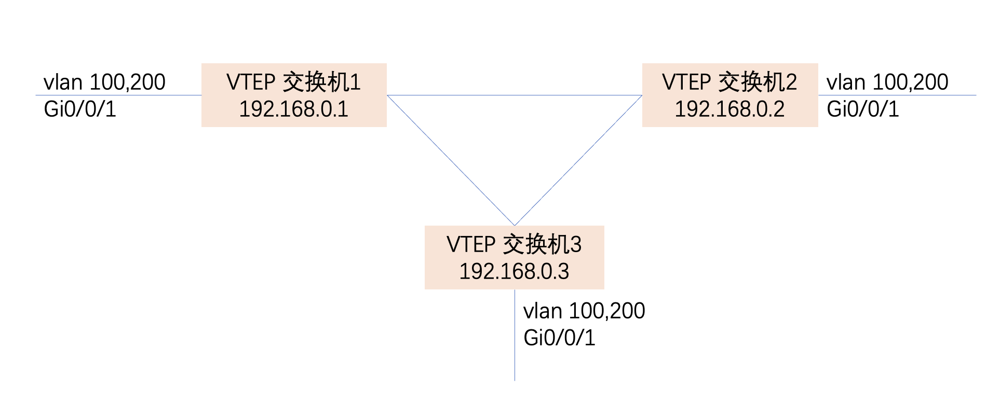
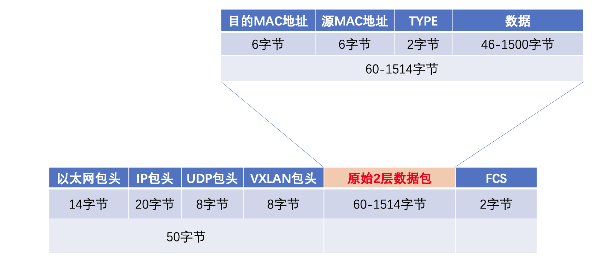

## [原创] 使用vxlan实现校区间vlan透传

本文原创：**中国科学技术大学 张焕杰**

修改时间：2025.04.27

# 一、使用vxlan实现校区间vlan透传



如上网络拓扑，3台支持VXLAN功能的交换机放置在3个校区，交换机loopback 接口IP是192.168.0.1、192.168.0.2、192.168.0.3。3台交换机的loopback 接口间互相IP可达。

实现vlan 100、vlan 200 在校区间透传。

下图是使用VXLAN传输以太网包的简单解释。原始的数据包使用UDP发送到对端设备，一般使用UDP端口4789。因此使用VXLAN时，沿途链路的MTU要比通常的1500大，建议不少于1600字节。



以下为使用华为S5731-H交换机作为VTEP交换机的配置示例。

# 二、交换机1配置

以下仅仅展示vxlan有关配置。实现loopback接口互通的配置未提供。
```
vlan batch 100 200

bridge-domain 100
 l2 binding vlan 100
 vxlan vni 100
bridge-domain 200
 l2 binding vlan 200
 vxlan vni 200

interface GigabitEthternet0/0/1
 port link-type trunk
 port trunk allow-pass vlan 100 200
 stp disable

interface LoopBack0
 ip address 192.168.0.1 255.255.255.255

interface Nve1
 source 192.168.0.1
 vni 100 head-end peer-list 192.168.0.2
 vni 100 head-end peer-list 192.168.0.3
 vni 200 head-end peer-list 192.168.0.2
 vni 200 head-end peer-list 192.168.0.3
```

# 三、交换机2配置

以下仅仅展示vxlan有关配置。实现loopback接口互通的配置未提供。
```
vlan batch 100 200

bridge-domain 100
 l2 binding vlan 100
 vxlan vni 100
bridge-domain 200
 l2 binding vlan 200
 vxlan vni 200

interface GigabitEthternet0/0/1
 port link-type trunk
 port trunk allow-pass vlan 100 200
 stp disable

interface LoopBack0
 ip address 192.168.0.2 255.255.255.255

interface Nve1
 source 192.168.0.2
 vni 100 head-end peer-list 192.168.0.1
 vni 100 head-end peer-list 192.168.0.3
 vni 200 head-end peer-list 192.168.0.1
 vni 200 head-end peer-list 192.168.0.3
```


# 四、交换机3配置

以下仅仅展示vxlan有关配置。实现loopback接口互通的配置未提供。
```
vlan batch 100 200

bridge-domain 100
 l2 binding vlan 100
 vxlan vni 100
bridge-domain 200
 l2 binding vlan 200
 vxlan vni 200

interface GigabitEthternet0/0/1
 port link-type trunk
 port trunk allow-pass vlan 100 200
 stp disable

interface LoopBack0
 ip address 192.168.0.3 255.255.255.255

interface Nve1
 source 192.168.0.3
 vni 100 head-end peer-list 192.168.0.1
 vni 100 head-end peer-list 192.168.0.2
 vni 200 head-end peer-list 192.168.0.1
 vni 200 head-end peer-list 192.168.0.2
```

# 五、VTEP交换机loopback接口IP可达的实现

VTEP交换机loopback接口IP可达可以采用多种方式实现。

如果VTEP交换机接口2层可达，使用OSPF等动态路由是最简单的方式，这里不再说明。

如果VTEP交换机接口间2层不可达，同时有多条链路，可以使用nqa辅助静态路由来实现。如下是一种配置，当ping通对方接口地址时，增加loopback接口IP的静态路由：

```
ip route-static 192.168.0.2 255.255.255.255 192.168.23.2 preference 5 track nqa user test1

 source-interface GigabitEthernet0/0/12
 start now

nqa test-instance user test1h
 test-type icmp
 destination-address ipv4 192.168.22.1
 frequency 11
 interval seconds 5
 timeout 4
 probe-count 2
 source-interface GigabitEthernet0/0/12
 start now
```


***
欢迎 [加入我们整理资料](https://github.com/bg6cq/ITTS)
