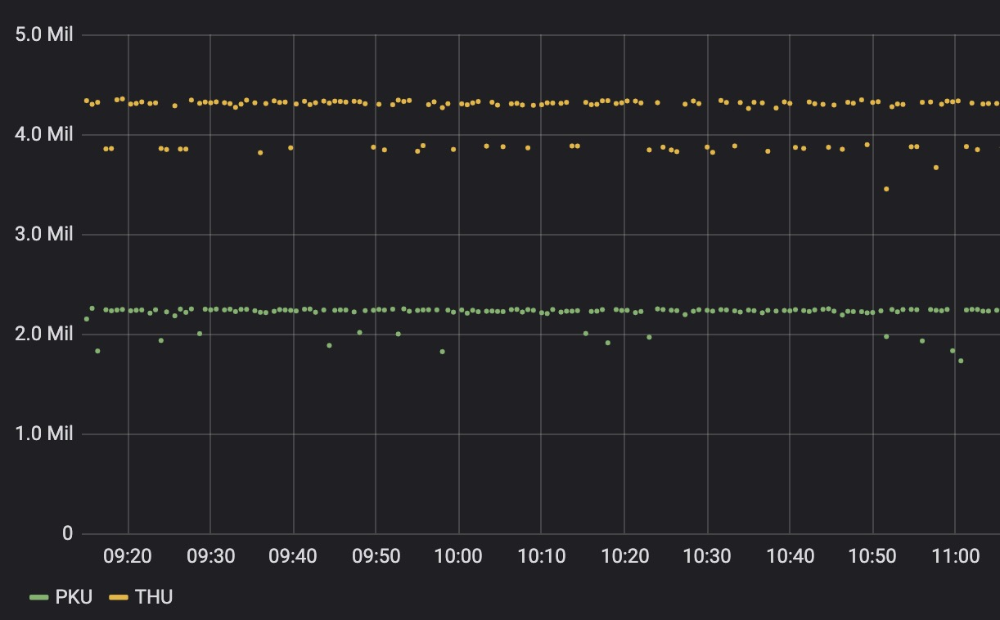
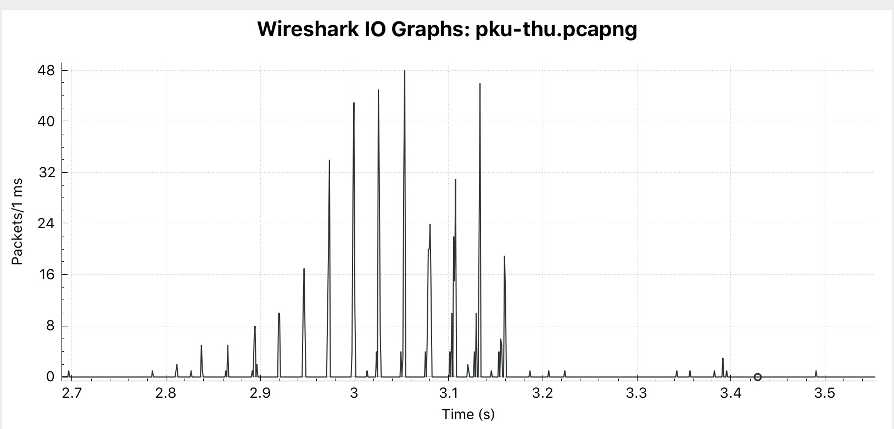
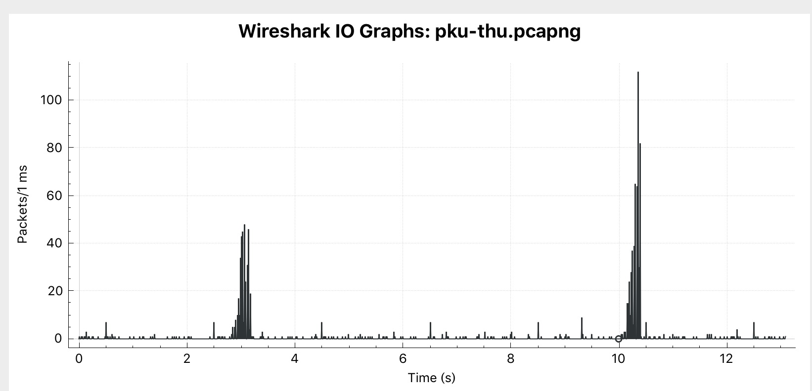
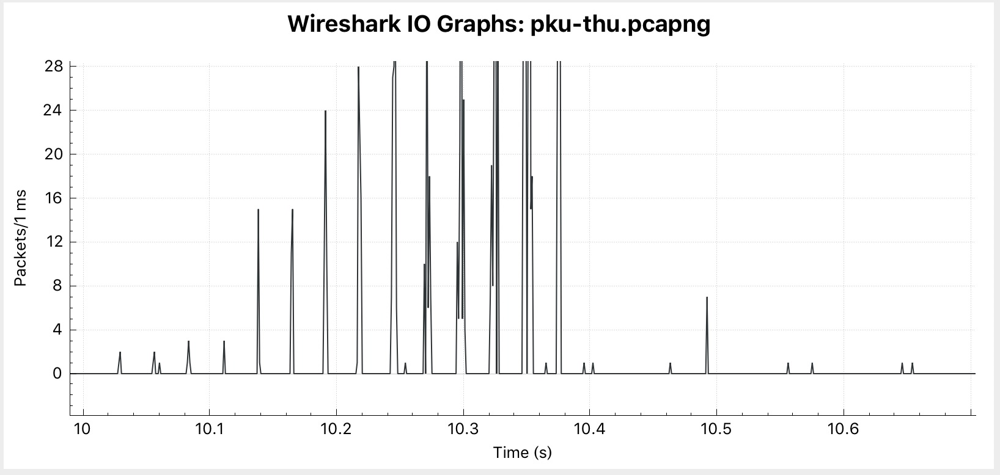
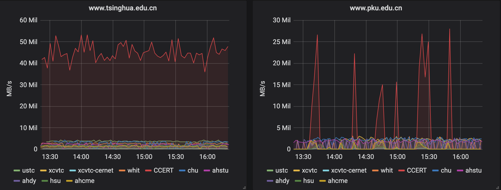
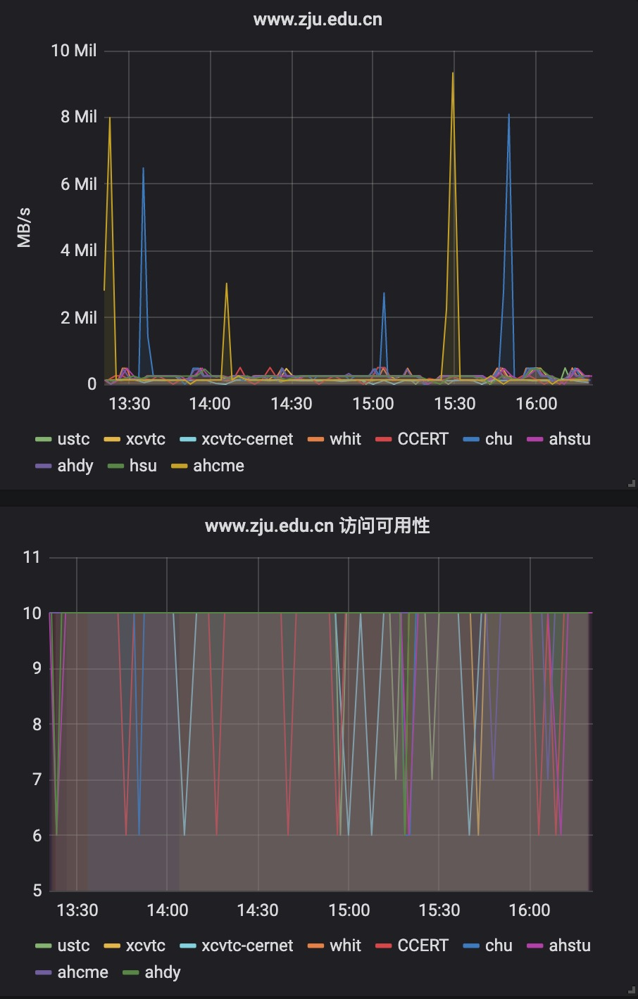

## [原创] 网站测试中发现的有趣现象

本文原创：**中国科学技术大学 张焕杰**

修改时间：2019.05.25

2018年建设了 http://ipv6.ustc.edu.cn ，测试跟踪各站点对 IPv6/v4 的 HTTP/HTTPS/HTTP2支持情况。

学校的网站，自己校内访问总觉得很满意。但是从其他地方访问，速度、稳定性满意吗？特别是跟兄弟单位网站的对比情况，总是值得探究的话题。

近期做了个分布式网站访问测试系统，运行了半个月，发现了一些有趣的现象，分享给大家。

### 一、分布式测试系统简介

分布式测试系统分两部分：

1. 中心端

中心端主要是存放测试结果的influxdb和web展示的grafana。

2. 测试点（SITE）

测试点定期对制定的URL访问测试，记录dns查询时间、tcp连接建立时间、获得第一个响应的时间、传输字节数、传输时间、传输速度等信息。
并将这些信息提交给中心端，存放到influxdb中。

测试点上使用 https://github.com/bg6cq/httptest 完成具体的测试，提交给中心端使用 curl。

测试点可参考 https://github.com/bg6cq/ahstatus 建设。

为了简化测试点的部署，使用docker方式部署，可以实现完全的自动更新。

测试时，为了让结果更有代表性，选择每个网站上大约500KB大小的文件进行测试。

向提供测试点运行的学校相关老师表示诚挚感谢！

下面是测试结果中一些比较有趣的现象。

### 二、为何PKU站点比THU慢

上图是从科大测试点通过IPv6线路访问PKU和THU的下载速度，THU一直稳定4MB/s，而PKU一直稳定2MB/s，每个点是原始数据。

科大到PKU/THU间IPv6通信延迟约26ms，带宽很宽也不应该有设备限制带宽，为何测试结果很像是带宽被限制呢？

经过抓包分析，发现是TCP窗口大小引起的。

抓包发现，PKU的服务器不支持tcp window scale选项，因此服务器端发送的最大窗口是64KB，链路延迟26ms左右。
也就是每26ms，服务器最多发送64KB，折合速度大约是64/0.026=2.4MB/s(实测2.2MB/s)。按照每ms统计数据包，是下面的图：

而THU服务器，一上来发送tcp window scale选项7，也就是可以支持>64KB的窗口。实际传输时，窗口大小在130KB左右变化，因此速度比pku高了近一倍。
下午是每ms统计数据包对比，左边是PKU下载的数据包，右边是THU下载的数据包：

THU自己的每ms统计是下图：

从图里看，由于TCP窗口不够大，带宽远没有被占满。

初步估计测试点到服务器端有1G的带宽，26ms延迟，填满整个链路需要2.6MB，因此需要有2.6MB的窗口大小，才会完全用满链路带宽。

### 三、pku网站的兼容性

下图是从多个测试点访问THU和PKU的速度：

从中可以看到PKU的访问速度抖动很厉害。

经对比测试，如果用docker常用的alpine linux中的OpenSSL 1.1.1b 26 Feb 2019库，访问PKU时，https传输过程中会偶尔中断，其他高校未发现该现象，原因未知。

### 四、ZJU网站的怪异行为

下图是从多个测试点访问ZJU的速度和返回码。正常的返回码是10，返回码6的含义是非200应答。

从中可以看到ZJU的访问比较慢，而且有大量非200返回码。

经详细测试，发现www.zju.edu.cn访问确实不快。它似乎是通过某个CDN服务的，速度慢，而且访问IPv6地址时，还经常给出302重定向到某个IPv4地址的响应。

### 五、NJU网站的不稳定

下图是从多个测试点访问NJU的速度和返回码。正常的返回码是10，返回码7的含义是未读取到正确的HTTP应答：

从中可以看到NJU的访问有大量非200返回码。

经详细测试，发现www.nju.edu.cn访问不稳定，表现在tls协商后，发送HTTP GET请求后，服务器不响应的情况。

***
欢迎 [加入我们整理资料](https://github.com/bg6cq/ITTS)
