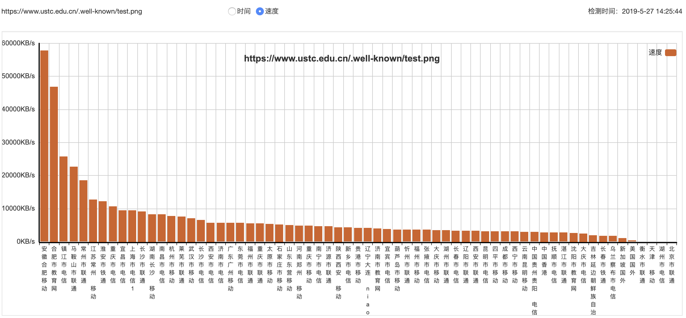
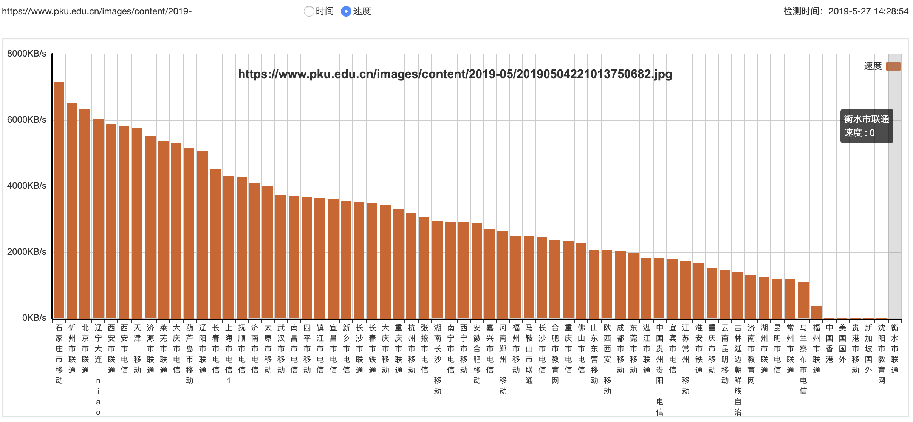
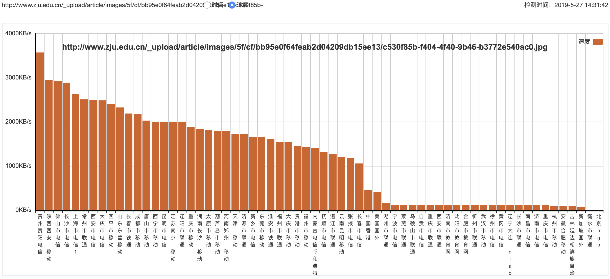
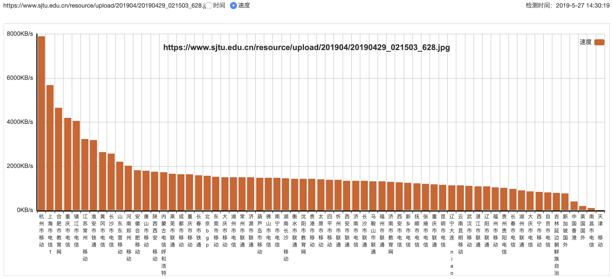
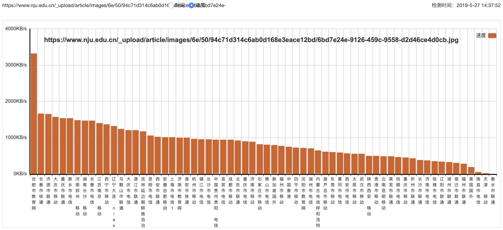
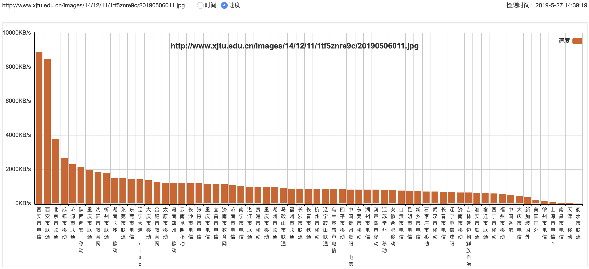
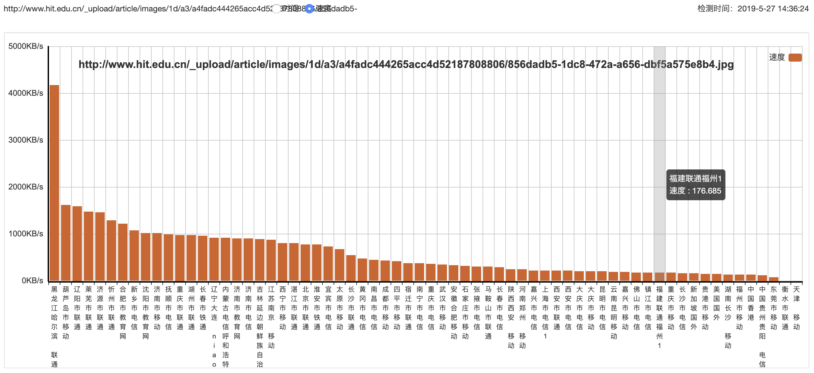
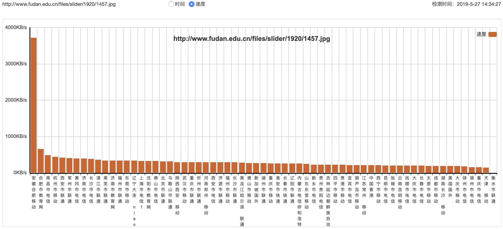

## C9高校网站传输速度大比拼 

本文原创：**中国科学技术大学 张焕杰**

修改时间：2019.05.27

### 1. 测试方法

使用 http://17ce.com，依次会以下URL测试，截图并记录中位数的访问速度。

| 学校 | 传输速度 |
| ---  | -----: |
|ustc  | 4.3MB/s |
|pku | 3.0MB/s |
|tsinghua |1.5MB/s |
|zju | 1.5MB/s |
|sjtu | 1.4MB/s |
|nju | 0.9MB/s |
|xjtu | 0.8MB/s |
|hit | 0.4MB/s |
|fudan | 0.3MB/s |

***
欢迎 [加入我们整理资料](https://github.com/bg6cq/ITTS)
