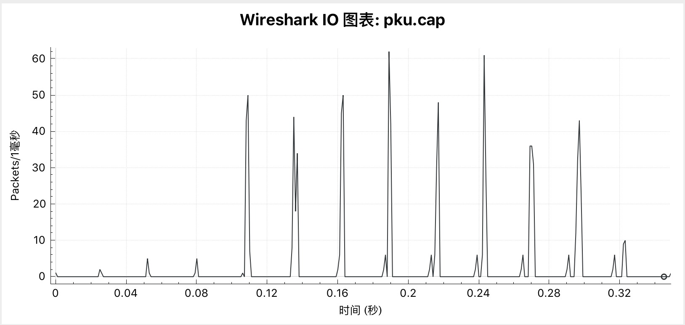
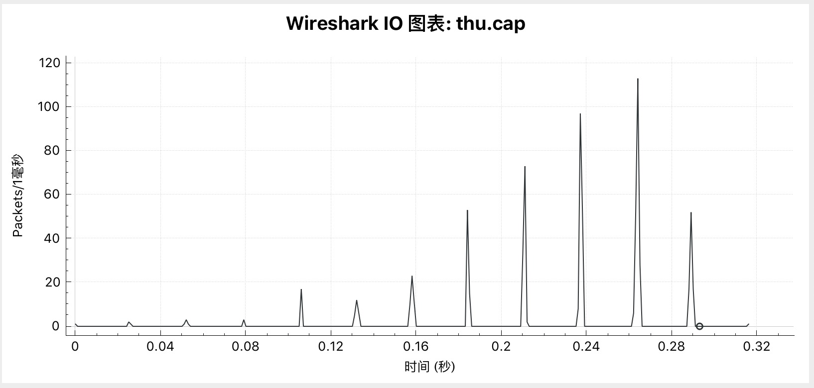
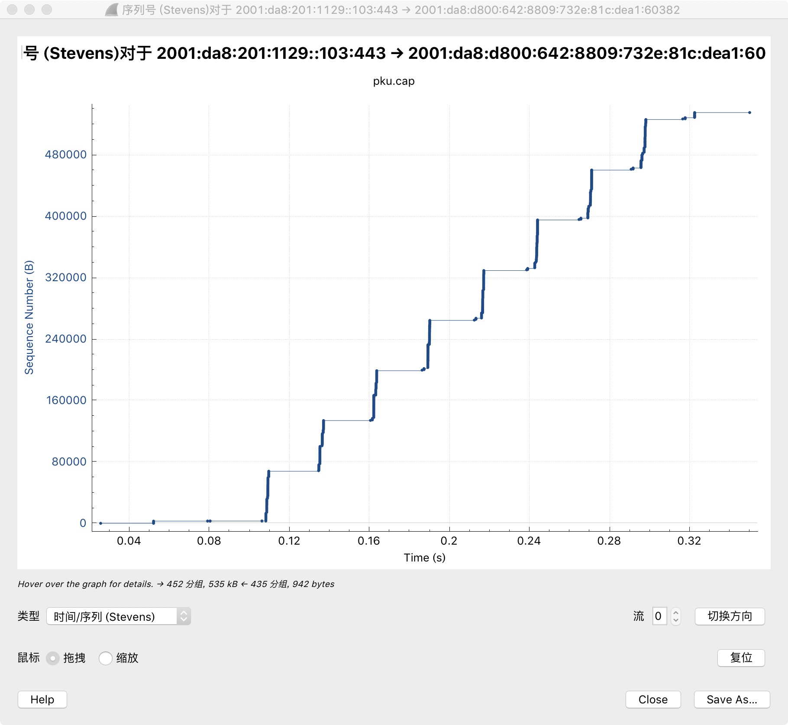
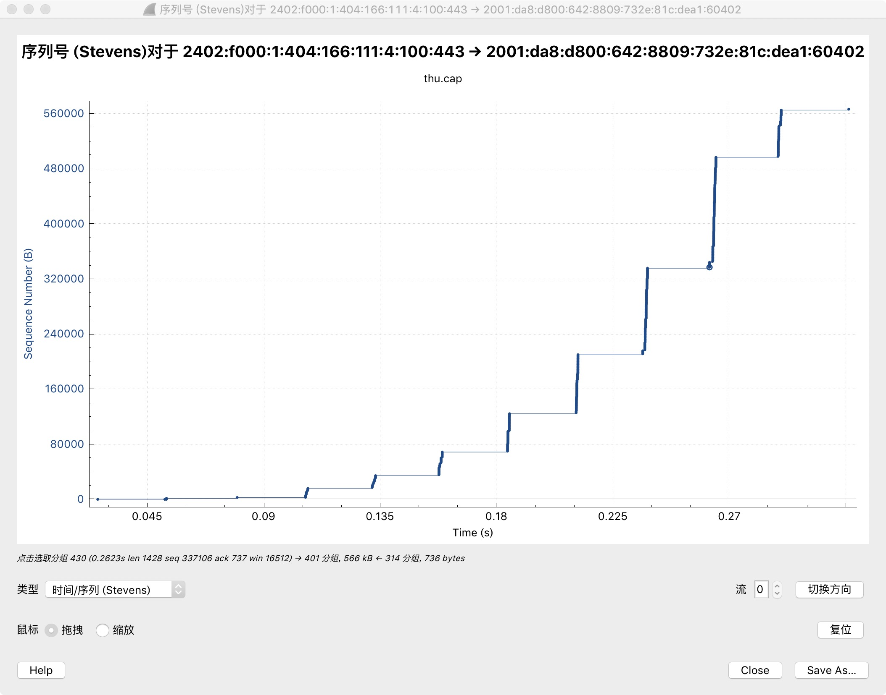

## PKU比THU慢的真相大白

本文原创：**中国科学技术大学 张焕杰**

修改时间：2019.05.26

### 1. 性能差异来自哪里

http://github.com/bg6cq/httptest 是一个简单的http/https测试工具。

从我的PC机（Mac MINI）对PKU/THU网站上500KB左右的文件测试，结果PKU的传输速度在2.5MB/s，而THU的传输速度可以到3.5MB/s。

我的PC机到PKU/THU服务器使用IPv6协议，中间带宽接近1G，延迟大约26ms。

为了弄清楚差异的来源，有了本篇文章。

### 2. 测试过程

httptest在Mac OS下编译，需要`brew install glibc-openssl`，并在Makefile中增加 `-I... -L...`等选项。

测试过程如下（测试时tcpdump抓包，文件请见 [pku.cap](pku.cap) 和 [thu.cap](thu.cap) ）:
```
$ ./httptest https://www.pku.edu.cn/images/content/2019-05/20190504221013750682.jpg
0 0.0019 0.0808 0.0282 0.2145 526119 2452998 https://www.pku.edu.cn/images/content/2019-05/20190504221013750682.jpg

$ ./httptest -d https://www.tsinghua.edu.cn/publish/thu2018en/11490/20190514123145278682465/20190514123259685120480.jpg
0 0.0019 0.0801 0.0521 0.1586 562687 3547457 https://www.tsinghua.edu.cn/publish/thu2018en/11490/20190514123145278682465/20190514123259685120480.jpg
```

上述结果含义如下：

| 站点 | DNS解析时间 | TCP/TLS协商时间| 响应时间 | 传输时间 | 内容长度    | 传输速度    |
| ---  | ----------: | -------------: | -------: | -------: | ----------: | --------:   |
| PKU  | 0.0019s     |  0.0808s       | 0.0282s  | 0.2145s  | 526119 Byte | 2452998 B/s |
| THU  | 0.0019s     |  0.0801s       | 0.0521s  | 0.1586s  | 562687 Byte | 3547457 B/s |

### 3. IO图表

Wireshark中打开 tcpdump 获取的 .cap 文件，选择菜单 统计(Statistics)/IO图表(I/O Graph)，将间隔改为 1ms， 可以看到以下2个传输过程的图表：





这个图大致可以看到传输分若干批完成，其中PKU每批最多60个左右数据包，而THU每批的数据包从开始的10余个逐步增多到100余个。

仔细分析数据包可以发现httptest对THU的统计有误，原因在于PKU/THU的TLS传输采用的分组方式不同。

PKU刚开始时把1408字节长度的TLS包放入一个TCP包传输，如抓包中的第18个数据包。

而THU刚开始时把16408字节长度的TLS包放入若干TCP包传输，如抓包中的第13-32包。

后续的传输，PKU也有将一个TLS包放入多个TCP包传输的。

由于TLS分包传输的原因，THU抓包中的第13-32是一组长度为16408字节的加密分组，httptest读到TLS解密的响应时，必须等到这一组包全部收到，
这时距离收到第1个响应包已经经过了大约0.0259s，修正结果后：

| 站点 | DNS解析时间 | TCP/TLS协商时间| 响应时间 | 传输时间 | 内容长度    | 传输速度    |
| ---  | ----------: | -------------: | -------: | -------: | ----------: | --------:   |
| PKU  | 0.0019s     |  0.0808s       | 0.0282s  | 0.2145s  | 526119 Byte | 2452998 B/s |
| THU  | 0.0019s     |  0.0801s       | 0.0262s  | 0.1845s  | 562687 Byte | 3049794 B/s |

即便这样修正后，PKU还是比THU慢一些，原因在哪里呢？

### 4. 第1批数据包对比

第1批数据包指的是客户端发出HTTP GET后，服务器返回的第1批数据包。

PKU的第1批数据包是抓包中的第18-38、第61-62、第68-91共47个数据包，从0.108201秒 - 0.109657秒，对应的TCP窗口是 3046 - 68580，即服务器端CWND是65535字节。

客户端建立连接时，第1个包RWND是65535(据说windows和Mac OS是这样，Linux是MSS*10)，后续已经增大，第3个包为131328，第4个包为131328，...，最后一次发给服务器端而且服务器一定收到第16个包为131072。

THU的第1批数据包是抓包中的第13-15、第18、第20-21、第24-25、第27、第29共10个数据包，从0.106035秒 - 0.106977秒，对应的TCP窗口是 2954 - 17233，即服务器端CWND是14280字节。

客户端建立连接时，第1个包RWND是65535，后续已经增大，第3个包为131328，第4个包为131328，...，最后一次发给服务器端而且服务器一定收到第12个包为131072。

从这里可以看到发送第1批数据时，PKU CWND是65535字节，THU CWND是14280字节。IPv6的时候，TCP包MSS是1428字节，MSS*10=14280字节，这似乎是某个版本后Linux kernel默认的行为。

### 5. 第2批数据包对比

PKU的第2批数据包是抓包中的第118-196中的数据包，从0.134567秒 - 0.137032秒，对应的TCP窗口是 68581 - 134115，即服务器端CWND是65535字节。

这期间客户端发送给服务器的RWND一直在128KB左右。

THU的第2批数据包是抓包中的第30-52中的数据包，从0.131817秒 - 0.133239秒，对应的TCP窗口是 17234 - 35797 ，即服务器端CWND是18564字节。

这期间客户端发送给服务器的RWND一直在128KB左右。

从这里可以看到发送第2批数据时，PKU CWND是65535字节，THU CWND是18564字节。

### 6. 第3批数据包对比

PKU的第3批数据包是抓包中的第222-303中的数据包，从0.160474秒 - 0.163618秒，对应的TCP窗口是 134116 - 199650，即服务器端CWND是65535字节。

这期间客户端发送给服务器的RWND一直在128KB左右。

THU的第3批数据包是抓包中的第53-85中的数据包，从0.157658秒 - 0.158932秒，对应的TCP窗口是 35798 - 70069 ，即服务器端CWND是34272字节。

这期间客户端发送给服务器的RWND一直在128KB左右。

从这里可以看到发送第3批数据时，PKU CWND是65535字节，THU CWND是34272字节。

### 7. 第7批数据包对比

PKU的第7批数据包是抓包中的第631-713中的数据包，从0.264673秒 - 0.271003秒，对应的TCP窗口是 395909 - 461443，即服务器端CWND是65535字节。

这期间客户端发送给服务器的RWND一直在128KB左右。

THU的第7批数据包是抓包中的第430-593中的数据包，从0.262267秒 - 0.264761秒，对应的TCP窗口是 337106 - 498235 ，即服务器端CWND是161130字节。

这期间客户端发送给服务器的RWND增大到240KB左右。

从这里可以看到发送第7批数据时，PKU CWND是65535字节，THU CWND是161130字节。

### 8. 结论

根据上面分析，可以看到PKU服务器发送CWND窗口一直未超过65535，由于链路有26ms的延迟，导致理论最高传输带宽为65535/0.026=2520576 Byte/s。

而THU服务器端的发送CWND窗口会跟随客户端的RWND慢慢增大，所以传输会随着时间的推移，逐步增大。

越大的文件，THU比PKU快的越明显。

### 9. 可视化的工具方便查到问题

Wireshark中，菜单 统计(Statistics)/TCP流图形(TCP Stream Graphs)/时间序列(Stevens)(Time Sequence(Stevens)) 会生成下面的图形。

图形的一段一段代表TCP的序列号增长情况，可以看到PKU的每次增长几乎是相同的，而THU则越来越多。






***
欢迎 [加入我们整理资料](https://github.com/bg6cq/ITTS)
