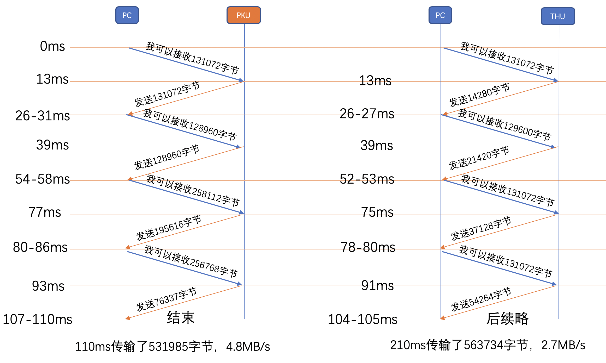

## 深入每个包分析pku和thu网站传输速度差异

本文原创：**中国科学技术大学 张焕杰**

修改时间：2019.05.27

### 1. pku和thu网站传输速度测试环境

从我的PC机（Mac MINI）对PKU/THU网站上500KB左右的文件测试，结果PKU的传输速度在2.5MB/s，而THU的传输速度可以到3.5MB/s。

我的PC机到PKU/THU服务器使用IPv6协议，中间带宽接近1G，延迟大约26ms。

为了弄清楚差异的来源，有了本篇文章。

### 2. 测试过程

httptest在Mac OS下编译，需要`brew install glibc-openssl`，并在Makefile中增加 `-I... -L...`等选项。

测试过程如下（测试时tcpdump抓包，文件请见 [pku-2.cap](pku-2.cap) 和 [thu-2.cap](thu-2.cap) ）:
```
$ ./httptest https://www.pku.edu.cn/images/content/2019-05/20190504221013750682.jpg
0 0.0582 0.0828 0.0283 0.0818 526119 6434683 https://www.pku.edu.cn/images/content/2019-05/20190504221013750682.jpg

$ ./httptest -d https://www.tsinghua.edu.cn/publish/thu2018en/11490/20190514123145278682465/20190514123259685120480.jpg
0 0.0293 0.0811 0.0522 0.1575 562687 3572911 https://www.tsinghua.edu.cn/publish/thu2018en/11490/20190514123145278682465/20190514123259685120480.jpg
```

上述结果含义如下：

| 站点 | DNS解析时间 | TCP/TLS协商时间| 响应时间 | 传输时间 | 内容长度    | 传输速度    |
| ---  | ----------: | -------------: | -------: | -------: | ----------: | --------:   |
| PKU  | 0.0582s     |  0.0828s       | 0.0283s  | 0.0818s  | 526119 Byte | 6434683 B/s |
| THU  | 0.0293s     |  0.0811s       | 0.0522s  | 0.1575s  | 562687 Byte | 3572911 B/s |

### 3. IO图表

Wireshark中打开 tcpdump 获取的 .cap 文件，选择菜单 统计(Statistics)/IO图表(I/O Graph)，将间隔改为 1ms， 可以看到以下2个传输过程的图表：


这个图大致可以看到传输分若干批完成，其中PKU分4批传输，而THU分8批传输。

仔细分析数据包可以发现httptest对THU的统计有误，原因在于PKU/THU的TLS传输采用的分组方式不同。

PKU刚开始时把1408字节长度的TLS包放入一个TCP包传输，如抓包中的第18个数据包。

而THU刚开始时把16408字节长度的TLS包放入若干TCP包传输，如抓包中的第13-32包。

由于TLS分包传输的原因，THU抓包中的第13-32是一组长度为16408字节的加密分组，httptest读到TLS解密的响应时，必须等到这一组包全部收到，
这时距离收到第1个响应包已经经过了大约0.0260s，修正结果后：

| 站点 | DNS解析时间 | TCP/TLS协商时间| 响应时间 | 传输时间 | 内容长度    | 传输速度    |
| ---  | ----------: | -------------: | -------: | -------: | ----------: | --------:   |
| PKU  | 0.0582s     |  0.0828s       | 0.0283s  | 0.0818s  | 526119 Byte | 6434683 B/s |
| THU  | 0.0293s     |  0.0811s       | 0.0262s  | 0.1836s  | 562687 Byte | 3064744 B/s |

这样修正后，PKU比THU快了近一倍，大家的网络都差不多，IPv6网络不拥堵，这个大的传输速度差异是什么原因导致的呢？

### 4. 传输数据对比

为了方便对比，将发送请求后（PKU是第16个包，THU是第12个包）返回的4批数据包汇总如下：



从中可以看到，PC机发送RWND 128KB左右时，PKU都能填满这个接收窗口。而THU的服务器，会慢慢的从14280（MSS*10）开始增长，逐步填满窗口。

由于链路延迟比较大有26ms，从发出请求时刻开始计算，PKU仅仅用110ms即完成了531985字节的传输，而THU使用210ms完成563734字节的传输。两个服务器的TCP层传输速度分别是4.8MB/s和2.7MB/s。

### 5. 结论

TCP传输过程中，窗口的管理对实际传输速度影响很大。对于大带宽/大延迟的链路，使用大的接收/发送窗口才能获得较高的传输速度。

同时需要注意的是，使用过大的接收发送窗口，存在一定的安全隐患。

如果服务器U完全接受PC端发来的RWND，PC端可以利用这一点进行CC攻击：使用较大的RWND，发起HTTP GET请求，服务器端在收到ACK前会发送RWND字节的数据，占用网络带宽。
以上面的抓包为例，攻击者仅仅需要发送3个数据包（SYN，ACK，HTTP GET，加起来300个字节以内），服务器会送出128KB字节的TCP包，攻击放大比例达到400多倍。

***
欢迎 [加入我们整理资料](https://github.com/bg6cq/ITTS)
