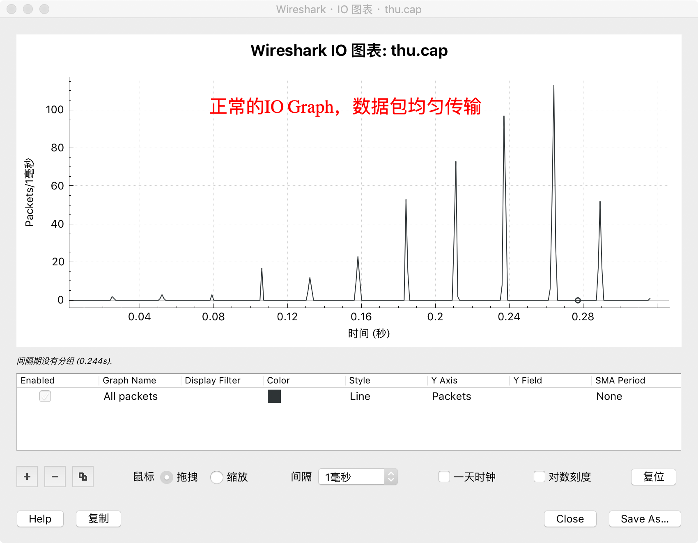
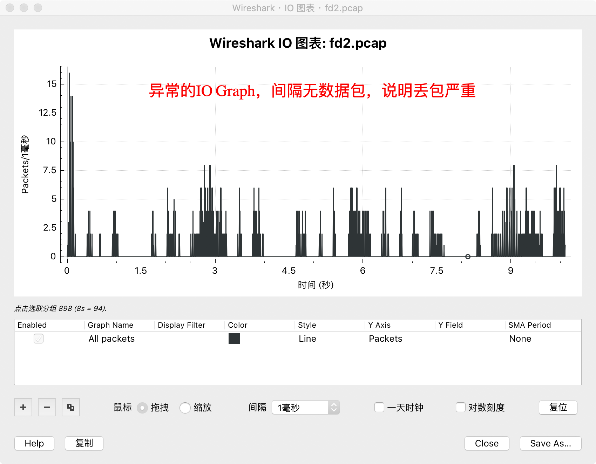
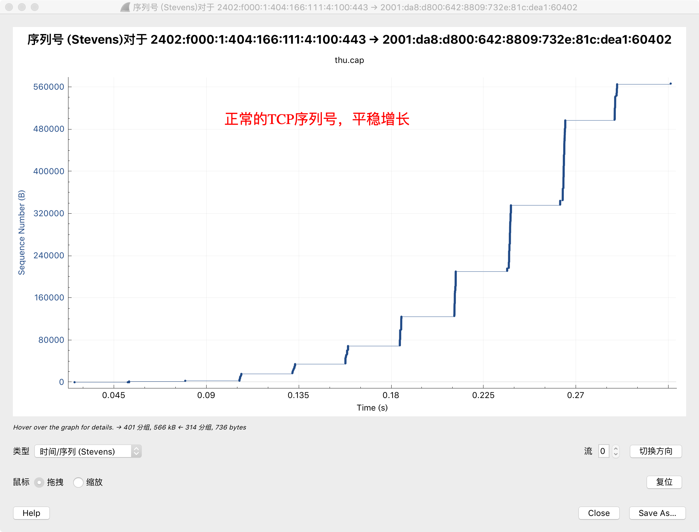
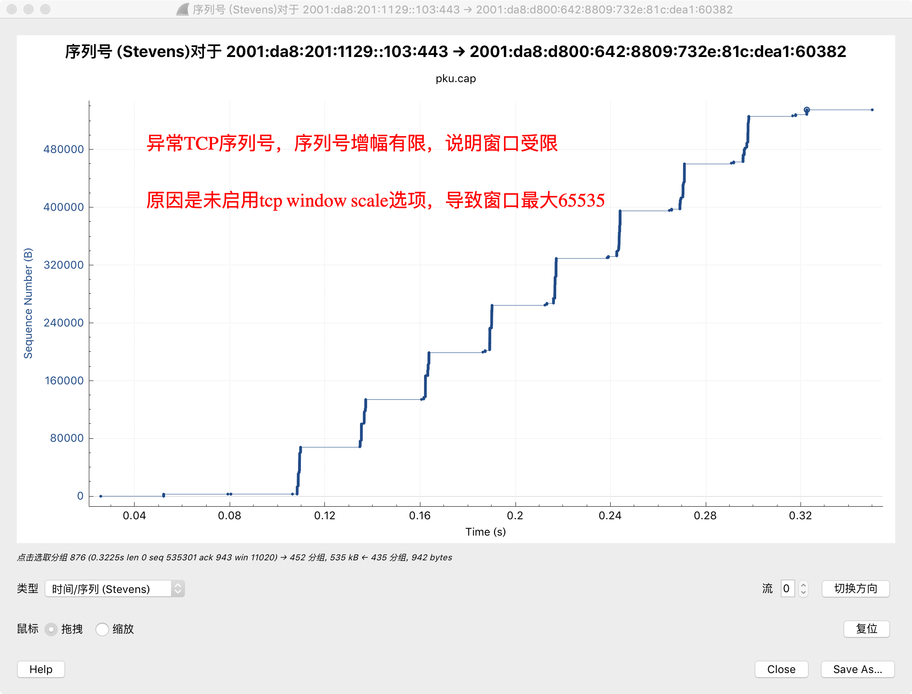
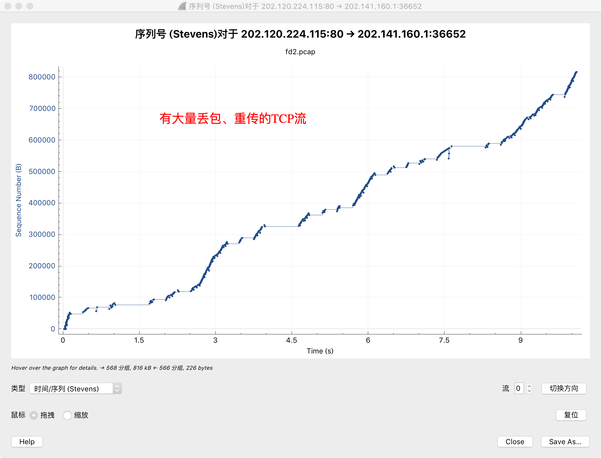

## [原创] 2张图、1分钟判断TCP故障

本文原创：**中国科学技术大学 张焕杰**

修改时间：2019.05.29

影响TCP性能的因素有链路带宽、链路延迟、链路丢包率、双方流控算法等4个因素。当TCP实际传输带宽远低于链路带宽时，我们称为TCP有故障。

本文介绍的方法，使用wireshark绘制的2张图，可以在1分钟内快速判断TCP故障原因。

Wireshark是一个免费数据包抓取和分析软件，它绘制的两种图可以用来快速判断TCP故障的原因。

### 一、帮助定位TCP故障的图

* I/O Graph

I/O Graph显示的某个时间间隔内传输的数据包数，为了有效查看TCP故障，我们可以把间隔设置为1ms。

下图是一个正常的I/O Graph，数据包相对均匀的传输。中间有空档是因为链路延迟，等待对方确认。

下图是相对异常的I/O Graph，中间有若干时间（长达0.5秒）没有数据包传输，说明链路存在间歇性丢包严重的情况。

* TCP流序列号图

TCP流序列号图显示某个方向的TCP序列号随时间的变化情况。为了有效查看TCP故障，我们需要单击"切换方向"选择从服务器-->客户端的流方向。

下图是一个正常的TCP流序列号图，序列号随时间逐步增长，且增幅越来越大（传输窗口越来越大）。

下图是一个异常的TCP流序列号图，序列号随时间逐步增长，但是增幅保持不变，说明传输窗口被限制了，导致实际传输慢。

下图是有重传现象的TCP流序列号图。实际网络中，少量重传是正常的。

下图是有较多丢包，大量重传现象的TCP流序列号图(Wireshark中可以通过鼠标缩放查看)。

通过以上两种图，可以很方便的分析TCP故障原因。

下面介绍生成以上两种图的步骤和方法。

### 二、获取数据包抓包文件

生成上述两种图，首先需要获取数据包抓包文件。获取数据包抓包文件有两种方式：

1. 直接使用Wireshark抓包
   
   可以方便的抓取本机收发的数据包

2. 使用tcpdump抓包

   `tcpdump -i ethx -s0 -w dump.cap host x.x.x.x`可以抓取与x.x.x.x主机通信的数据包并存入文件 dump.cap 

  Wireshark 可以直接打开文件 dump.cap

### 三、获取需要关注的TCP流

Wireshark获取到抓包后，选中需要关注TCP流中任一数据包时，单击鼠标右键，选择"对话过滤器/TCP"，可以将该TCP流的所有数据包选中。

此时在菜单 "文件/导出特定分组" 中可以将需要关注的TCP流数据包存为单独文件。

### 四、生成图表

Wireshark打开仅仅包含一个TCP流数据包的单独文件，使用菜单 "统计/IO图表" 即可绘制I/O Graph，建议选择间隔为 1ms 以方便观察。

使用菜单 "统计/TCP流图形/时间序列(Stevens)" 即可绘制TCP流序列号图，需要单击"切换方向"选择从服务器-->客户端的流方向。

***
欢迎 [加入我们整理资料](https://github.com/bg6cq/ITTS)
