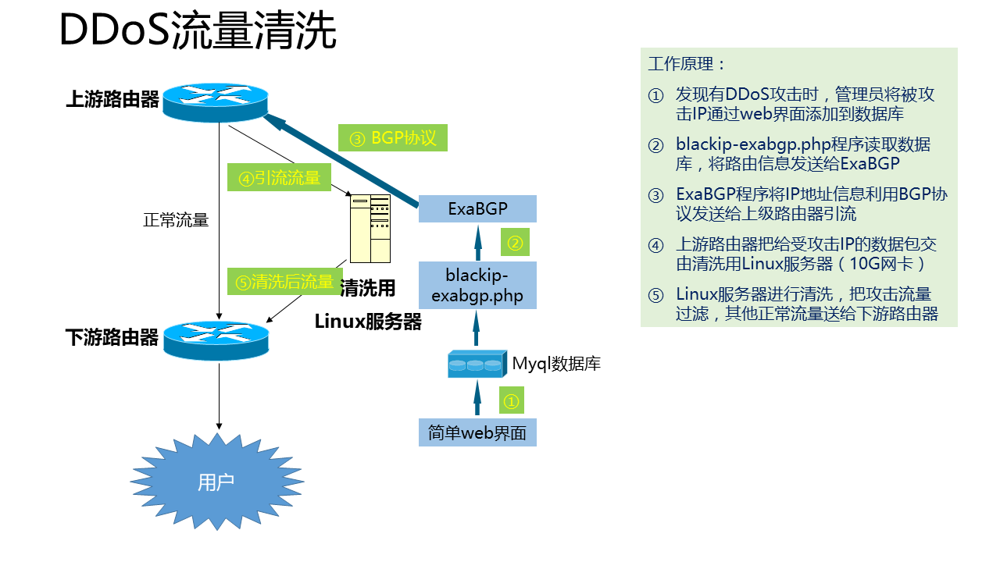

## [原创]使用ExaBGP发送BGP路由信息和清洗DDoS流量

本文原创：**中国科学技术大学 张焕杰**

修改时间：2017.11.18

## 一、BGP介绍

BGP是路由协议，通过BGP协议可以方便的控制路由器上的路由表，运维中最常用是用于引流或黑洞路由。

把某个IP的next-hop设置为特定的IP，称为引流。用于黑洞路由时，
通常是把IP的next-hop设置为192.0.2.1，并通过`ip route 192.0.2.1/32 null0` 丢包。

## 二、ExaBGP简介

[ExaBGP](https://github.com/Exa-Networks/exabgp) 是一个python开发的BGP客户端，被称为BGP的瑞士军刀，
可以与路由器建立BGP连接，发送和接收BGP更新消息。

其他程序可以方便的利用简单的文本协议与ExaBGP通信，发送和接收BGP更新消息。

本文给出一个简单例子，使用简单文本发送BGP更新消息。

需要说明的是，exabgp 4.0版本的配置文件有较大变化，本文使用的是3.4版本。

## 三、ExaBGP安装

不少系统发行版有ExaBGP，可以直接安装。

也可以从github下载，方法是：

````
cd /usr/src/
git clone https://github.com/Exa-Networks/exabgp.git
cd exabgp
git checkout 3.4
./bin/healthcheck --help
````
healthcheck能运行说明程序安装正常。对于CentOS系统，可能需要安装以下软件包：
````
yum install python-argparse python-ipaddr socat

````

## 四、ExaBGP配置文件

假定本机IP是210.45.230.89，ASN 65500；路由器是210.45.230.90，ASN 24362

vi /etc/exabgp.conf

````
neighbor 210.45.230.90 {
        local-address 210.45.230.89;
        peer-as 24362;
        local-as 65500;
        router-id 210.45.230.89;
        process service-dynamic {
                run /usr/bin/socat stdout pipe:/var/run/exabgp.cmd;
        }
}
````

## 五、路由器配置片段

为了减少风险，仅仅接受ExaBGP发来的/32路由，并且最多接受10条路由。以下为华为/H3C配置：
````
ip ip-prefix only32 index 10 permit 0.0.0.0 0 greater-equal 32 less-equal 32
router bgp 24362
 peer 210.45.230.89 as-number 65500
 ipv4-family unicast
  peer 210.45.230.89 enable
  peer 210.45.230.89 ip-prefix only32 import
  peer 210.45.230.89 route-limit 10 
ip route-static 192.0.2.1 32 null0
````

## 六、ExaBGP启动

/var/run/exabgp.cmd是其他程序与ExaBGP通信的管道文件。

如果是调试，可以使用以下命令启动
````
env exabgp.daemon.user=root /usr/src/exabgp/sbin/exabgp /etc/exabgp.conf
````
启动后，程序的输出在屏幕上，从路由器上看到BGP连接建立说明正常。

调试完毕，可以使用如下命令启动：

````
env exabgp.daemon.user=root exabgp.daemon.daemonize=true exabgp.daemon.pid=/var/run/exabgp.pid \
        exabgp.log.destination=/var/log/exabgp.log /usr/src/exabgp/sbin/exabgp /etc/exabgp.conf
````
/var/log/exabgp.log记录有日志输出。

## 七、增加删除路由

向/var/run/exabgp.cmd 管道写文本就可以控制ExaBGP发送BGP消息，简单的例子如下：

发送BGP路由：
````
echo announce route 202.38.95.255/32 next-hop 192.0.2.1 > /var/run/exabgp.cmd
echo announce route 202.38.95.0/32 next-hop 210.45.230.89 > /var/run/exabgp.cmd
````
撤回BGP路由：
````
echo withdraw route 202.38.95.255/32 > /var/run/exabgp.cmd
````
执行以上命令后，ExaBGP有信息输出，登录路由器执行
```
display bgp routing-table pee 210.45.230.89 received-routes
```
可以看到发来的路由信息。

## 八、一个简单的WEB界面

请参考 https://github.com/bg6cq/blackip-exabgp

使用mysql数据库存放信息，blackip-exabgp.php程序不停的轮询数据库，如果有新的路由需要发送或旧的路由需要撤回，会与 ExaBGP 通信。

## 九、使用ExaBGP发送路由处理DDoS攻击

我们使用ExaBGP给上游路由器发送受DDoS攻击的IP，把DDoS流量引流到Linux服务器，Linux服务器清洗流量后注入网络。



请参考 http://blackholeah.ustc.edu.cn/admin/intro.php 。


***
欢迎 [加入我们整理资料](https://github.com/bg6cq/ITTS)
