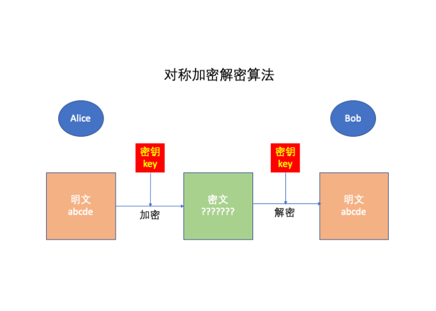
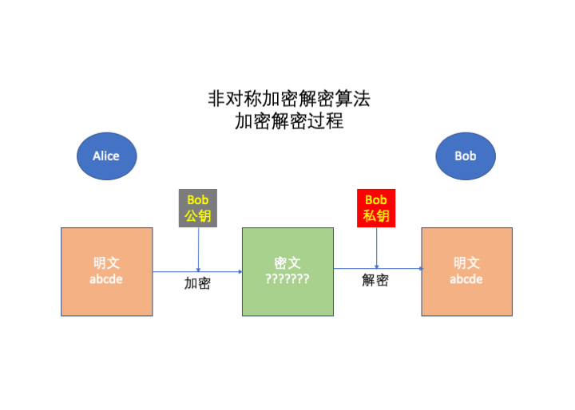
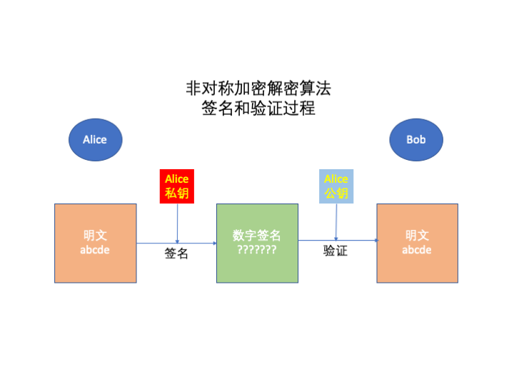
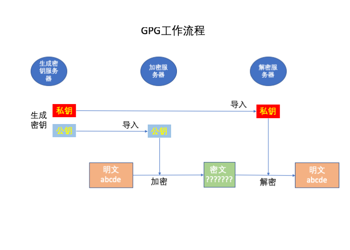

## [原创] 从一个简单的备份需求演示GPG的使用

本文原创：**中国科学技术大学 张焕杰**

修改时间：2019.01.26

## 一、一个简单需求

领导说：要保障数据安全，做好备份工作。现在预算紧张，有那么多免费的云空间，能否直接备份到云上呢？

## 二、需求落实调研

各种脚本可以上传/下载云空间文件，只要解决了安全问题，使用云空间备份是可行的。

为了安全，显然要在备份上传前对文件进行加密。说到加密，就离不开两种加解密算法：

### 2.1 对称加解密算法

对称加解密算法，它的特点是加密和解密操作使用同样的密钥key。



常见的对称加解密算法有AES、3DES等，一般来说性能很高，每秒钟可以加解密100MB字节或更多的信息。

一旦密钥key泄漏，加密的信息就可以被解密，也就是泄漏了。

如果使用对称加密算法加密备份文件，然后再上传到云空间，似乎能解决数据安全问题，但实际上这样做有很大的安全隐患：

对称加解密算法加密时需要密钥key，为了自动化操作，势必要在服务器上存放密钥key。一旦服务器被入侵，密钥key泄漏，之前所有加密的备份文件，都可以被解密而泄漏。

### 2.2 非对称加解密算法

非对称加解密算法，它的特点是加密和解密操作使用不同的密钥。2个密钥成对出现，1个称为私钥(private key)需要私密保存，另1个称为公钥(public key)可以对外公开。

在单独知道公钥的情况下，短时间无法推导或计算出私钥。



常见的非对称加解密算法有RSA、ECC，一般来说加密/解密的性能比对称加解密算法要慢2-3个数量级。

除了简单加解密外，非对称加解密算法还可以完成数字签名、身份认证等工作。
如果说对称加解密是农耕时代，非对称加解密算法则是进入到电气化时代。


对于上述备份加密需求，服务器上可以仅仅存放公钥，备份文件使用公钥加密后上传到云空间。公钥本来就是公开的，即使服务器被入侵，也不会泄漏什么。
需要解密文件时，再拿出单独保存的私钥来完成文件解密操作。

### 2.3 实际应用

实际使用时，往往采用非对称加解密算法来加密解密文件密钥key，然后通过性能高的对称加解密算法使用文件密钥key完成对文件的快读加解密操作。这样做既保证了安全性，又能提供很高的性能。

以上原理看起来复杂，使用常见的gpg(GnuPGP)软件操作并不复杂，主要包含如下步骤：
* 生成私钥和公钥
* 导出私钥和公钥
* 把公钥导入要备份的服务器
* 加密文件
* 导入私钥
* 解密文件



最早实现加密/解密功能的软件是PGP，但它是商业软件。gpg(GnuPGP)是一个实现了类似PGP功能的开源软件。

以下演示在CentOS 7.0下完成，gpg版本是 2.0.22

## 三、操作演示

### 3.1 生成私钥和公钥

在一台安全的机器上，生成私钥和公钥对。由于我们是做备份文件的加密，因此有效期可以设置为0（永不过期）。
期间会提示输入一个密码用来保护私钥，请记住这个密码。私钥将用这个密码加密存放，一但忘记这个密码，
将无法获取到私钥，也就无法解密用公钥加密的文件。

由于需要足够的随机性，生成私钥和公钥的时间比较长，我花了30分钟左右。

```console
# gpg --gen-key
gpg (GnuPG) 2.0.22; Copyright (C) 2013 Free Software Foundation, Inc.
This is free software: you are free to change and redistribute it.
There is NO WARRANTY, to the extent permitted by law.

请选择您要使用的密钥种类：
   (1) RSA and RSA (default)
   (2) DSA and Elgamal
   (3) DSA (仅用于签名)
   (4) RSA (仅用于签名)
您的选择？ 1
RSA 密钥长度应在 1024 位与 4096 位之间。
您想要用多大的密钥尺寸？(2048)4096
您所要求的密钥尺寸是 4096 位
请设定这把密钥的有效期限。
         0 = 密钥永不过期
      <n>  = 密钥在 n 天后过期
      <n>w = 密钥在 n 周后过期
      <n>m = 密钥在 n 月后过期
      <n>y = 密钥在 n 年后过期
密钥的有效期限是？(0) 0
密钥永远不会过期
以上正确吗？(y/n)y

You need a user ID to identify your key; the software constructs the user ID
from the Real Name, Comment and Email Address in this form:
    "Heinrich Heine (Der Dichter) <heinrichh@duesseldorf.de>"

真实姓名：backup user
电子邮件地址：backup@ustc.edu.cn
注释：
您选定了这个用户标识：
    “backup user <backup@ustc.edu.cn>”

更改姓名(N)、注释(C)、电子邮件地址(E)或确定(O)/退出(Q)？o
您需要一个密码来保护您的私钥。

我们需要生成大量的随机字节。这个时候您可以多做些琐事(像是敲打键盘、移动
鼠标、读写硬盘之类的)，这会让随机数字发生器有更好的机会获得足够的熵数。


--- 这里等了大约30分钟

gpg: /root/.gnupg/trustdb.gpg：建立了信任度数据库
gpg: 密钥 AC76A983 被标记为绝对信任
公钥和私钥已经生成并经签名。

gpg: 正在检查信任度数据库
gpg: 需要 3 份勉强信任和 1 份完全信任，PGP 信任模型
gpg: 深度：0 有效性：  1 已签名：  0 信任度：0-，0q，0n，0m，0f，1u
pub   4096R/AC76A983 2019-01-26
密钥指纹 = 8762 C5E9 9525 D863 8742  7D06 8C06 2706 AC76 A983
uid                  backup user <backup@ustc.edu.cn>
sub   4096R/339EB9D2 2019-01-26
```

输入以下命令可以查看生成的私钥和公钥信息。实际上生成了一个主密钥（master key）和一个子密钥(subkey)，每个
密钥包含私钥和公钥，其中的sec是主密钥私钥(SECret key)，ssb是子密钥私钥(Secret SuBkey)，pub是主密钥公钥(PUBlic key)，
sub是子密钥公钥(public SUBkey)。主密钥是用来对子密钥进行签名的，并不直接使用。

```console
# gpg --list-secret-key
/root/.gnupg/secring.gpg
------------------------
sec   4096R/AC76A983 2019-01-26
uid                  backup user <backup@ustc.edu.cn>
ssb   4096R/339EB9D2 2019-01-26

# gpg --list-key
/root/.gnupg/pubring.gpg
------------------------
pub   4096R/AC76A983 2019-01-26
uid                  backup user <backup@ustc.edu.cn>
sub   4096R/339EB9D2 2019-01-26
```


### 3.2 导出私钥和公钥

执行以下命令可以将私钥和公钥导出成文件：
```console
# gpg --armor --export-secret-keys > sec.key
# gpg --armor --export-secret-subkeys > ssb.key
# gpg --armor --export > pub.key
```
sec.key 是主密钥和子密钥私钥，ssb.key 是子密钥私钥，这两个文件使用生成密钥时输入的密码加密保存的，切记要保密存放。

pub.key 是两者的公钥，可以公开。 公开公钥最简单的方法是送给key server，如把AC76A983密钥的公钥送给pgp.ustc.edu.cn（中国科大的pgp key server，注意这里的域名是pgp，因为最早的软件是PGP，gpg是GnuPGP）
```
#  gpg --keyserver pgp.ustc.edu.cn  --send-key AC76A983
gpg: 将密钥‘AC76A983’上传到 hkp 服务器 pgp.ustc.edu.cn
```
这时访问 http://pgp.ustc.edu.cn/ ，输入 0xAC76A983，可以查询到对应的公钥信息，内容就是文件 pub.key。


### 3.3 导入公钥

在要备份的机器，即将来要加密文件的机器上，导入公钥。

```console
# gpg --import pub.key
gpg: 密钥 AC76A983：公钥“backup user <backup@ustc.edu.cn>”已导入
gpg: 合计被处理的数量：1
gpg:           已导入：1  (RSA: 1)
```

使用以下命令可以验证公钥已经导入，私钥为空：
```console
# gpg --list-key
/root/.gnupg/pubring.gpg
------------------------
pub   4096R/AC76A983 2019-01-26
uid                  backup user <backup@ustc.edu.cn>
sub   4096R/339EB9D2 2019-01-26

# gpg --list-secret-key
```

导入的key还不被信任，可以执行以下命令信任这个key，或者在第一次执行加密时，按照提示信任key。
```console
# gpg --edit-key AC76A983
gpg (GnuPG) 2.0.22; Copyright (C) 2013 Free Software Foundation, Inc.
This is free software: you are free to change and redistribute it.
There is NO WARRANTY, to the extent permitted by law.


pub  4096R/AC76A983  创建于：2019-01-26  有效至：永不过期  可用于：SC  
                     信任度：未知        有效性：未知
sub  4096R/339EB9D2  创建于：2019-01-26  有效至：永不过期  可用于：E   
[ 未知 ] (1). backup user <backup@ustc.edu.cn>

gpg> trust
pub  4096R/AC76A983  创建于：2019-01-26  有效至：永不过期  可用于：SC  
                     信任度：未知        有效性：未知
sub  4096R/339EB9D2  创建于：2019-01-26  有效至：永不过期  可用于：E   
[ 未知 ] (1). backup user <backup@ustc.edu.cn>

您是否相信这位用户有能力验证其他用户密钥的有效性(查对身份证、通过不同的渠道检查
指纹等)？

  1 = 我不知道或我不作答
  2 = 我不相信
  3 = 我勉强相信
  4 = 我完全相信
  5 = 我绝对相信
  m = 回到主菜单

您的决定是什么？5
您真的要把这把密钥设成绝对信任？(y/N)y

pub  4096R/AC76A983  创建于：2019-01-26  有效至：永不过期  可用于：SC  
                     信任度：绝对        有效性：未知
sub  4096R/339EB9D2  创建于：2019-01-26  有效至：永不过期  可用于：E   
[ 未知 ] (1). backup user <backup@ustc.edu.cn>
请注意，在您重启程序之前，显示的密钥有效性未必正确，

gpg> quit
```

### 3.4 加密文件

导入公钥后，加密文件非常简单，假定要加密的文件是 test.txt，加密后的文件是 test.txt.gpg。
```console
# gpg -e -r backup test.txt
```

### 3.5 导入私钥

解密文件之前，需要导入私钥。我们仅仅导入子密钥的私钥即可，导入私钥的同时也导入了公钥。
导入的密钥仍旧是加密的，因此这时并未要求输入密码。

```console
# gpg --import ssb.key 
gpg: 密钥 AC76A983：私钥已导入
gpg: /root/.gnupg/trustdb.gpg：建立了信任度数据库
gpg: 密钥 AC76A983：公钥“backup user <backup@ustc.edu.cn>”已导入
gpg: 合计被处理的数量：1
gpg:           已导入：1  (RSA: 1)
gpg:       读取的私钥：1
gpg:       导入的私钥：1
# gpg --list-key
/root/.gnupg/pubring.gpg
------------------------
pub   4096R/AC76A983 2019-01-26
uid                  backup user <backup@ustc.edu.cn>
sub   4096R/339EB9D2 2019-01-26

# gpg --list-secret-key
/root/.gnupg/secring.gpg
------------------------
sec#  4096R/AC76A983 2019-01-26
uid                  backup user <backup@ustc.edu.cn>
ssb   4096R/339EB9D2 2019-01-26
```

### 3.6 解密文件

解密文件就很简单了，以下命令会把 test.txt.gpg 文件解密输出到 test.txt，中间会要求输入密钥的密码。

```console
# gpg -o test.txt -d test.txt.gpg

您需要输入密码，才能解开这个用户的私钥：“backup user <backup@ustc.edu.cn>”
4096 位的 RSA 密钥，钥匙号 339EB9D2，建立于 2019-01-26 (主钥匙号 AC76A983)

gpg: 由 4096 位的 RSA 密钥加密，钥匙号为 339EB9D2、生成于 2019-01-26
      “backup user <backup@ustc.edu.cn>”

# cat test.txt
this is a test file
```

## 四、进阶使用

非对称密钥系统，最需要保护的是私钥。以上操作，虽然使用密码加密保存了私钥，但还是不够安全。

更安全的做法是把私钥除了离线保存（锁在保险柜中）备份外，平时不直接使用私钥，
而是使用一个存有私钥的硬件设备(如Yubikey)。

Yubikey是一个硬件设备，可以单向将私钥导入，无法读取私钥。Yubikey可以利用私钥信息，
实现RSA 4096bit的加密、解密、签名、认证等操作。

每次加密、解密等需要使用私钥参与处理时，还可以增加一个触摸按键人工确认的过程，更加安全可靠。

***
欢迎 [加入我们整理资料](https://github.com/bg6cq/ITTS)
