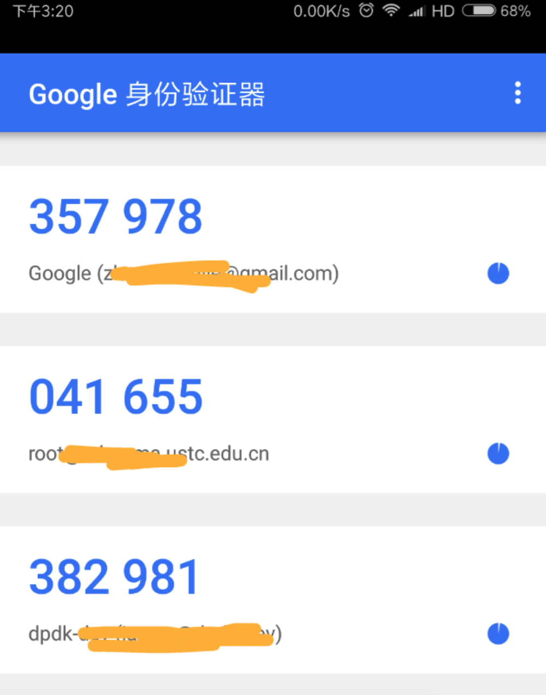

## [原创] 两步(多因素)认证原理及应用

本文原创：**中国科学技术大学 张焕杰**

修改时间：2018.01.07

## 一、单因素认证

通常的身份认证依靠密码来验证，密码称为一个认证因素。一旦这个认证因素泄漏，拿到密码的攻击者就可以
直接登录。

有时候使用一个私钥来认证，其作用与密码基本相同，可以认为是一种机器识别的密码，以下不再单独说明。

## 二、两步(多因素)认证

为了提高安全性，提出了两步认证（2-Step Verification，又称多因素认证，Multi-Factor Authentication）方式。

除了使用密码认证外，再增加一个认证因素，只有两步认证都通过，用户身份的认证过程才算完成。

第二种认证因素的形态和传输渠道与密码差异很大，如银行常见的有通过短信发送认证码，定时变化的数字token(Time-based One-Time Password)等。

增加了一种认证因素，增加了攻击者的难度。

## 三、TOTP认证原理

多因素认证中，使用最方便的就是TOTP，国内有些银行在用的TOTP是一个实体的key，如下图所示：

也有APP可以提供TOTP认证功能，如RedHat公司维护的[FreeOTP Authenticator](https://freeotp.github.io/)和Google Authenticator，这种TOTP可以以几乎0成本使用，非常方便，下图是Google Authenticator的截图:

服务器侧认证用户身份的工作过程和原理如下：

前提条件：
* 服务器侧和用户的TOTP设备预先有个双方约定的同一个密钥K(每个人的均不同)和一个算法
* 算法可以根据时间戳和密钥K计算出6位数字 (RFC6238 TOTP: Time-Based One-Time Password Algorithm)

验证过程：
* TOTP设备: 根据时间戳和密钥K计算出6位数字，显示给用户
* 用户: 将这6位数字交给服务器
* 服务器: 使用同样的算法计算出6位数字，如果与用户提交的相同，用户认证成功，否则认证失败

考虑到双方时间可能有偏差，用户输入也需要时间，因此服务器在验证时往往会计算当前时刻前后几分钟的6位数字，只要有
一个相同即认为认证成功。

## 四、FreeOTP Authenticator/Google Authenticator使用

1. 用户手机安装FreeOTP或Google Authenticator

手机端下载一个即可：

* FreeOTP Authenticator

Android手机 可以从 [Google Play](https://play.google.com/store/apps/details?id=org.fedorahosted.freeotp) 直接安装，也可以从[这里](https://f-droid.org/repo/org.fedorahosted.freeotp_17.apk)下载。

Apple手机 可以从 [Appstore](https://itunes.apple.com/us/app/freeotp-authenticator/id872559395?mt=8)下载。

* Google Authenticator

Android手机 可以从 [Google Play](https://play.google.com/store/apps/details?id=com.google.android.apps.authenticator2) 直接安装，也可以从[这里](http://lastpass.com/google-authenticator.apk)下载。

Apple手机 可以从 [Appstore](https://itunes.apple.com/gw/app/google-authenticator/id388497605?mt=8)下载。

2. 服务器侧安装相关的软件，并将密钥K交给FreeOTP Authenticator或Google Authenticator APP

由于协议是公开的，也有很多开源实现，因此很多服务器端都可以使用，如：
* [Github上各种语言版本](https://github.com/search?utf8=%E2%9C%93&q=GoogleAuthenticator&type=)
* Linux pam 模块，常用于ssh登录认证等

服务器侧生成密钥K后，可以直接显示给用户以便输入FreeOTP或Google Authenticatorp，也可以产生二维码，
由FreeOTP或Google Authenticator扫码自己记录。

具体各种服务器的配置请自行google，一般来说都不复杂。

对于Linux服务器的ssh增加两步认证，安装配置很快(注意SELinux的影响)，几分钟就可以。

比如对于Ubuntu系统，参照参考资料中的链接很快就可以设置好。

需要注意的是，Google Authenticator仅仅使用TOTP中的SHA1 HASH算法，而FreeOTP则支持更多的HASH算法，此外FreeOTP还支持HOTP（RFC4226 HMAC-based One-Time Password (HOTP) algorithm）。

3. 安全要点

双方共享的密钥K需安全保存，一旦泄漏，两步认证就无法起到认证的作用。

以Linux服务器的ssh两步认证为例，用户目录下`.google_authenticator`文件存放有密钥K，如果这个密钥泄漏，两步认证就没有意义了。

## 五、参考资料

* [谷歌验证 (Google Authenticator) 的实现原理是什么？](https://www.zhihu.com/question/20462696)
* [How To Set Up Multi-Factor Authentication for SSH on Ubuntu 16.04](https://www.digitalocean.com/community/tutorials/how-to-set-up-multi-factor-authentication-for-ssh-on-ubuntu-16-04)

***
欢迎 [加入我们整理资料](https://github.com/bg6cq/ITTS)
