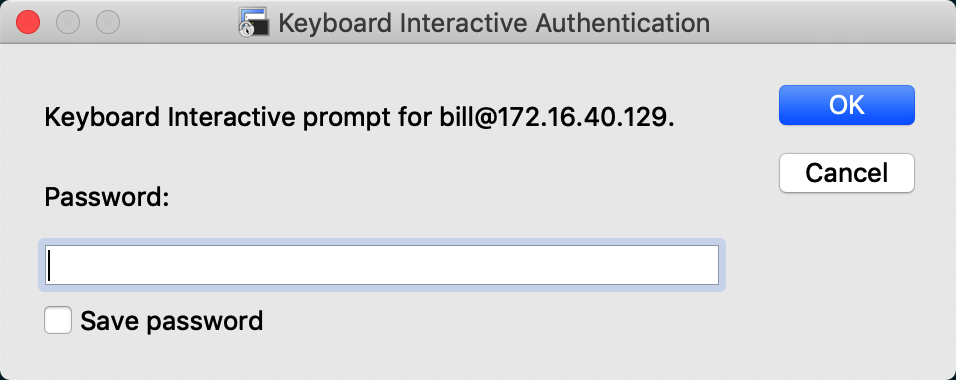
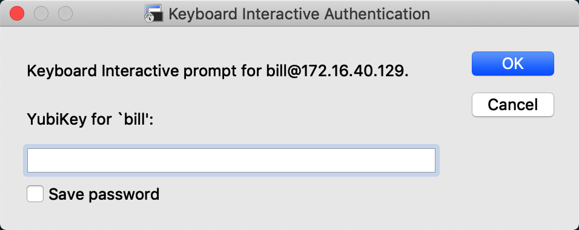

# 在 SSH 上使用 Yubico OTP 两步验证

作者：西北农林科技大学 卞一帆

创建日期：2019/04/20

## Yubikey 和 Yubico OTP

YubiKey是由Yubico生产的身份认证设备，支持一次性密码（OTP）、公钥加密和身份认证，以及由FIDO联盟（FIDO U2F）开发的通用第二因素（U2F）协议。它允许用户透过提交一次性密码或是使用设备产生的公开/私密密钥来安全地登录自己的帐户。针对不支持一次性密码的网站，YubiKey也可以存储静态密码。Facebook使用YubiKey作为员工凭证；Google同时为雇员和用户提供支持。LastPass、1Password 等密码管理器也支持YubiKey。

Yubikey实现了基于HMAC的一次性密码算法（HOTP）和基于时间的一次性密码算法（TOTP），并且将本身作为一个通过USB HID协议的键盘来提供一次性密码。新的YubiKey 还包含许多协议，如使用2048位RSA和椭圆曲线加密系统（ECC）p256和p384的OpenPGP卡、近场通信（NFC）以及FIDO U2F。YubiKey允许用户对消息签名、加密且同时不暴露私钥。第4代YubiKey于2015年11月16日推出，支持4096位RSA密钥的OpenPGP，并有PIV智能卡的PKCS11支持，还允许对Docker映像进行代码签名。

*参考资料：[Yubikey - 维基百科](https://zh.wikipedia.org/wiki/YubiKey)*

各种 Yubikey ：[Identify your YubiKey](https://www.yubico.com/products/identifying-your-yubikey/)

Yubico OTP 是所有现在被官方支持的 YubiKey 都有的一个功能，开箱即用。在使用 USB 连接到计算机时触摸按键或将其接触 NFC 设备可以让 YubiKey 产生一个字符串并输入到设备中，这个字符串可以作为两步验证因素。

*参考资料：[https://developers.yubico.com/OTP/](https://developers.yubico.com/OTP/)*

## 目的

为了提高安全性，这个配置的目的是使用户可以通过以下认证方式中的一种登录到服务器：

- 使用 Public Key
- 同时满足以下两个条件
  - 输入正确的密码
  - 通过 Yubico OTP 的验证

## 环境

我使用的环境是 Ubuntu 18.04.2 LTS ，于2019年4月20日安装并更新所有软件包到最新版本。YubiKey 型号是 YubiKey 5 NFC 。

## 配置

1. 安装 pam_yubico ：

```bash
sudo add-apt-repository ppa:yubico/stable
sudo apt-get update
sudo apt-get install libpam-yubico
```

2. 申请 API Key

访问 [https://upgrade.yubico.com/getapikey/](https://upgrade.yubico.com/getapikey/) ，输入自己的邮箱，并从 Yubikey 输入一个 YubiKey OTP 。
提交后可以得到一对 Client ID 和 Secret Key 。

3. 创建用户组

因为不是所有用户都有 YubiKey ，在此创建一个用户组，只有这个用户组里的用户才需要使用 YubiKey 验证。

如果需要强制所有人通过 YubiKey 验证，在 PAM 的配置文件里做相应修改，或者在 `sshd_config` 中使用 `AllowGroup` 。

```bash
sudo addgroup --gid 401 yubikey

# 把有 YubiKey 的用户添加到组里
sudo usermod -a -G yubikey bill
```

4. 创建 YubiKey 数据库

创建并编辑 `/etc/ssh/authorized_yubikeys`，内容形如：

```
bill:aaaaaaaaaaaa:bbbbbbbbbbbb
test:cccccccccccc
```

每行对应一个用户，使用冒号分隔各个字段。每行第一个字段是用户名，后面每个字段代表一个 YubiKey ID （每个 YubiKey OTP 的前 12 位字符）。
我在配置时，在 vim 中输入 `:` 后触摸我的 YubiKey 5 NFC 上的按键输入一个 YubiKey OTP ，然后按 ESC 退出插入模式，按 `b` 回退到 YubiKey OTP 的开始，再按 `12ld$` 即可删除后续字符，只留前 12 个。

这个文件所有者和所属用户组均为 `root` ，权限应当设为 `0600` 。


4. 配置 PAM

编辑 `/etc/pam.d/sshd`，在 `@include common-auth` 这一行后面添加：

```
auth [default=1 success=ignore] pam_succeed_if.so user ingroup yubikey
auth required pam_yubico.so id=CLIENT_ID key=SECRET_KEY authfile=/etc/ssh/authorized_yubikeys
```

`CLIENT_ID` 和 `SECRET_KEY` 分别是第二步中申请到的 Client ID 和 Secret Key 。

第一行用于判断用户是否是 yubikey 组的成员，如果是则继续验证 YubiKey OTP ，如果不是则跳过 YubiKey 验证。

如果要强制所有用户 SSH 登录时进行 YubiKey 验证，删掉第一行即可。

5. 配置 sshd

编辑 `/etc/ssh/sshd_config` ，做相应修改：

```
ChallengeResponseAuthentication yes
UsePAM yes
```

然后重启 sshd ： `sudo systemctl restart ssh`

## 效果

使用 Password 方式认证：不在 yubikey 组的用户可以认证成功，yubikey 组用户总是认证失败。

使用 PublicKey 方式认证：无论用户是否在 yubikey 组，都可以不需要 YubiKey OTP ，可以直接登录。因为可以认为 PublicKey 方式认证的强度已经足够高，不再需要 YubiKey OTP 。

使用 Keyboard Interactive 方式认证：不在 yubikey 组的用户输入密码后即可登录，在 yubikey 组的用户通过密码验证后还要通过 YubiKey OTP 验证才能登录。

YubiKey OTP 没有时间限制，但是 YubiCloud 服务器在验证 OTP 时会验证 Counter ，确保 Counter 单调增加。详细信息参考[官方文档](https://developers.yubico.com/OTP/OTPs_Explained.html)。





## 参考资料

- [LiNode: How to use a YubiKey for Two-Factor Secure Shell Authentication
](https://www.linode.com/docs/security/authentication/how-to-use-yubikey-for-two-factor-ssh-authentication/)
- [Yubico OTP Documentation](https://developers.yubico.com/OTP/)
