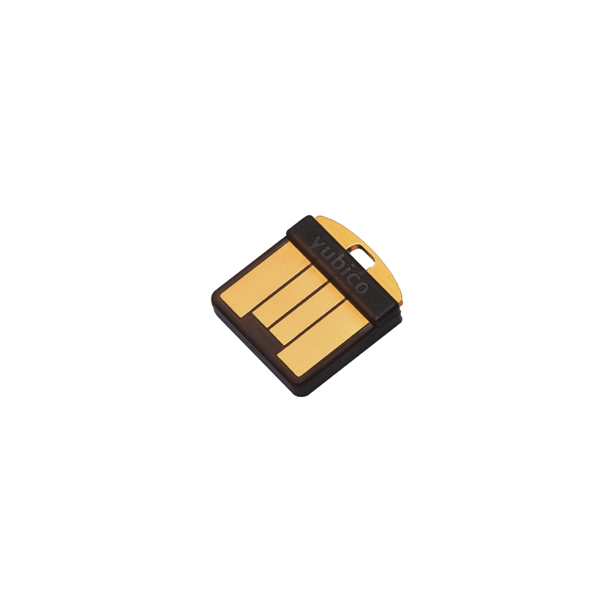
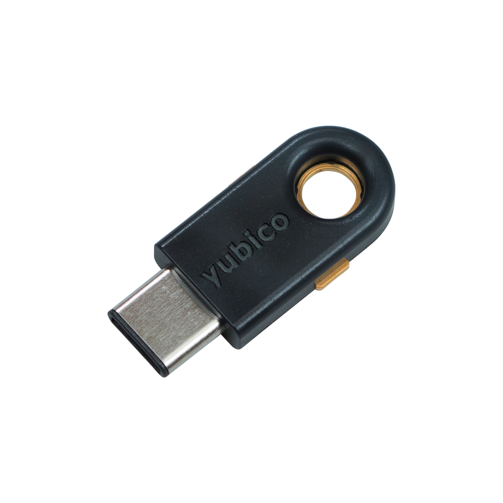
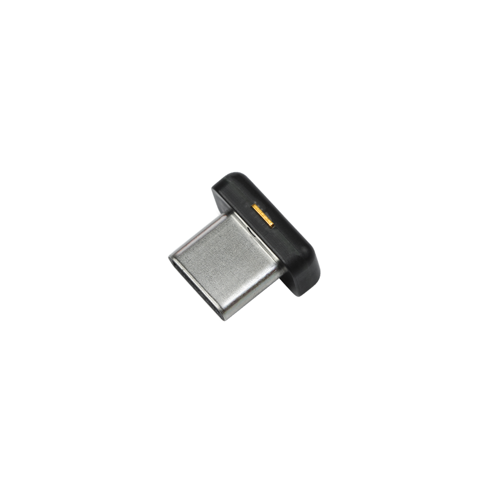

## [原创] 人人都需要一个yubikey

本文原创：**中国科学技术大学 张焕杰**

修改时间：2019.01.29

## 一、啥是yubikey

就是下图的东西，带有一个触摸按键。可以是USB-A接口，也可以是USB-C接口；可以挂在钥匙链上，也可以一直插在计算机的USB口。

| YUBIKEY 5 NFC        |    YUBIKEY 5 Nano   | YUBIKEY 5C | YUBIKEY 5C NANO |
| :----------------- | :-------- | :-------- | :-------- |
|  |  |  |  

以上四种型号功能几乎相同，唯独5NFC增加了NFC通信支持（手机使用方便）。

原厂分别是45$、50$、50$、60$，taobao价格在400元-500元。我买了最左和最右边的。

## 二、yubikey有啥用

非对称加密算法是目前解决各种安全问题的基石，它依赖于以下几点：

| 要点   | 内容   |
| :----- | :----- |
| 公钥无法推算出私钥 | 算法保证  |
| 私钥保密存放 |  一旦私钥泄漏，所有基础都没了 |

yubikey用来存放私钥，且只能灌入私钥，永远不能读出，彻底解决私钥泄漏问题。

需要加密、签名、认证等操作时，计算机把信息通过USB口发给yubikey，由yubikey完成具体工作。

## 三、yubikey能干啥

| 功能    |    应用场景  |
| :----------------- | :-------- |
| 身份认证 | yubikey支持FIDO U2F、FIDO2等身份认证，Google、Facebook、Github、Dropbox等大厂均已支持 | 
| SSH | 支持ssh私钥认证，这可是系统管理员最常用的功能 |
| OpenPGP | 支持GPG的加密、签名等操作，用gpg签名代码再也不怕私钥泄漏 |

敲重点：使用SSH或PGP时，有个agent forwarding功能非常好用，太方便了。
也就是自己的PC机上插了yubikey，利用ssh登录到服务器S，在服务器S上执行ssh连接其他服务器或者
使用gpg时，仍旧可以使用PC机上的yubikey里存放的私钥来完成工作。

## 四、yubikey安全吗

* yubikey宣称私钥永远不能被读出。
* 有PIN码保护，使用私钥前要输入PIN码。PIN码错误几次后锁死。
* 有admin PIN码保护，灌入私钥或解锁PIN码需要输入admin PIN码。admin PIN码错误几次后彻底锁死，可以扔了。
* 有触摸确认过程，每次使用私钥前可以增加触摸按键确认动作，避免私钥被偷偷利用。

***
欢迎 [加入我们整理资料](https://github.com/bg6cq/ITTS)
